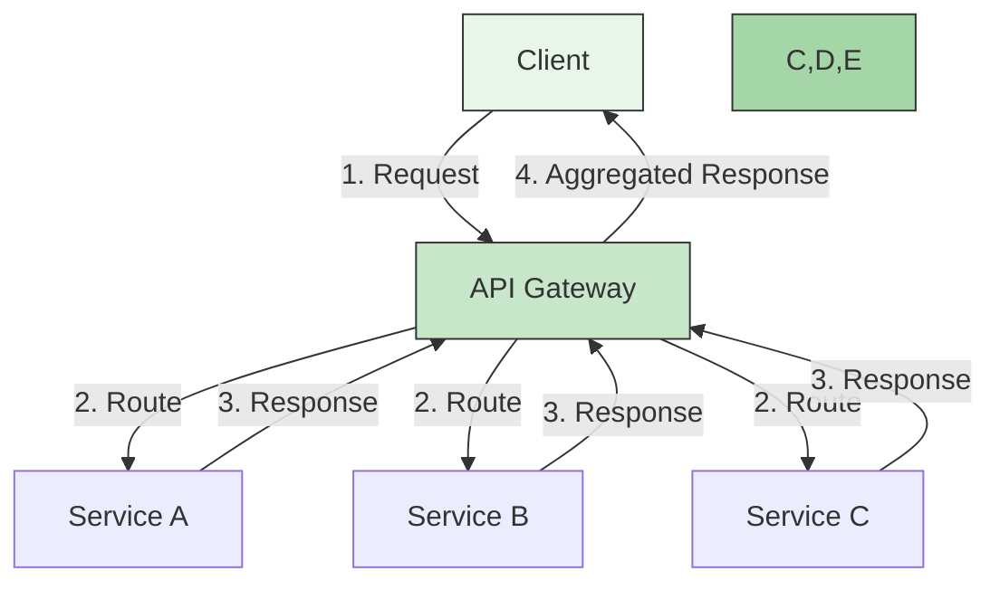
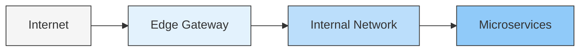
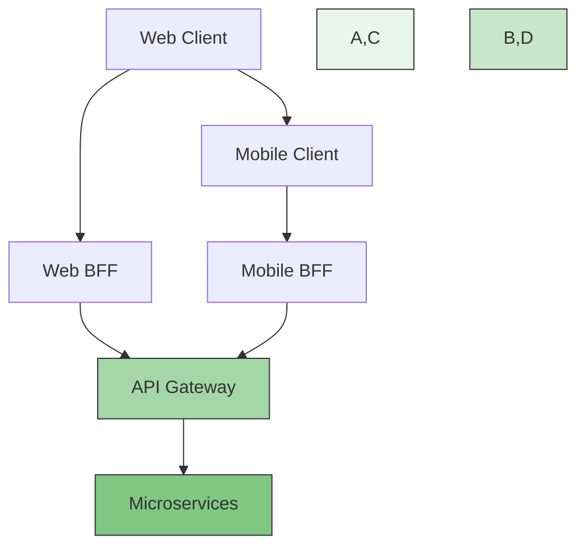

# 🌉 API Gateway Pattern in Microservices

## 📌 Overview
An API Gateway is a server that acts as an API front-end, receiving API requests, enforcing throttling and security policies, passing requests to the back-end service, and then passing the response back to the requester. It's a key component in microservices architecture that handles request routing, composition, and protocol translation.



## 🎯 Why Use an API Gateway?

| Benefit | Description | Example |
|---------|-------------|---------|
| **Simplified Client** | Clients interact with a single endpoint | Mobile app calls `api.example.com` |
| **Security** | Centralized authentication and authorization | JWT validation, OAuth2 |
| **Load Balancing** | Distributes traffic across service instances | Round-robin, least connections |
| **Protocol Translation** | Handles different protocols (HTTP/HTTPS, gRPC, WebSockets) | REST to gRPC translation |
| **Monitoring** | Centralized logging and metrics | Track API usage, response times |

## 🏗️ Architecture Patterns

### 1. Edge Gateway

- First point of contact for all external traffic
- Handles SSL termination, WAF, DDoS protection
- Routes to appropriate internal services

### 2. Backend for Frontend (BFF)

- Tailored API for specific client types
- Reduces over-fetching of data
- Optimized payloads for each client

## 🛠️ Implementation with Spring Cloud Gateway

### 1. Dependencies
Add to `build.gradle`:
```gradle
dependencies {
    implementation 'org.springframework.cloud:spring-cloud-starter-gateway'
    implementation 'org.springframework.cloud:spring-cloud-starter-netflix-eureka-client'
    implementation 'org.springframework.boot:spring-boot-starter-actuator'
}
```

### 2. Basic Configuration
```yaml
# application.yml
spring:
  cloud:
    gateway:
      routes:
        - id: order-service
          uri: lb://order-service
          predicates:
            - Path=/api/orders/**
          filters:
            - name: RequestRateLimiter
              args:
                redis-rate-limiter.replenishRate: 10
                redis-rate-limiter.burstCapacity: 20

        - id: product-service
          uri: lb://product-service
          predicates:
            - Path=/api/products/**
          filters:
            - name: CircuitBreaker
              args:
                name: productCB
                fallbackUri: forward:/fallback/product
```

### 3. Global Filters
```java
@Component
public class LoggingFilter implements GlobalFilter {
    private static final Logger logger = LoggerFactory.getLogger(LoggingFilter.class);

    @Override
    public Mono<Void> filter(ServerWebExchange exchange, GatewayFilterChain chain) {
        logger.info("Request path: {}", exchange.getRequest().getPath());
        return chain.filter(exchange);
    }
}
```

## 🔐 Security Implementation

### JWT Validation Filter
```java
@Component
public class JwtAuthenticationFilter implements GlobalFilter {
    @Override
    public Mono<Void> filter(ServerWebExchange exchange, GatewayFilterChain chain) {
        String token = exchange.getRequest()
            .getHeaders()
            .getFirst(HttpHeaders.AUTHORIZATION);

        if (token != null && token.startsWith("Bearer ")) {
            token = token.substring(7);
            // Validate token
            if (!isValidToken(token)) {
                exchange.getResponse().setStatusCode(HttpStatus.UNAUTHORIZED);
                return exchange.getResponse().setComplete();
            }
        } else {
            exchange.getResponse().setStatusCode(HttpStatus.UNAUTHORIZED);
            return exchange.getResponse().setComplete();
        }
        return chain.filter(exchange);
    }
}
```

## 📊 Monitoring and Metrics

### Prometheus Configuration
```yaml
management:
  endpoints:
    web:
      exposure:
        include: health,metrics,prometheus
  metrics:
    distribution:
      percentiles-histogram:
        http.server.requests: true
```

### Grafana Dashboard
- Track request rates
- Monitor error rates
- Analyze response times
- Set up alerts

## 🚀 Deployment Options

### 1. Docker Compose
```yaml
version: '3.8'
services:
  api-gateway:
    image: my-api-gateway:latest
    ports:
      - "8080:8080"
    environment:
      - SPRING_PROFILES_ACTIVE=docker
    depends_on:
      - discovery-service

  discovery-service:
    image: eureka-server:latest
    ports:
      - "8761:8761"
```

### 2. Kubernetes
```yaml
apiVersion: apps/v1
kind: Deployment
metadata:
  name: api-gateway
spec:
  replicas: 3
  selector:
    matchLabels:
      app: api-gateway
  template:
    metadata:
      labels:
        app: api-gateway
    spec:
      containers:
      - name: api-gateway
        image: my-api-gateway:latest
        ports:
        - containerPort: 8080
        resources:
          limits:
            memory: "512Mi"
            cpu: "500m"
```

## 🏆 Best Practices

1. **Performance**
   - Enable response compression
   - Implement caching
   - Use connection pooling

2. **Resilience**
   - Implement circuit breakers
   - Set timeouts and retries
   - Use bulkheading

3. **Security**
   - Enable HTTPS
   - Implement rate limiting
   - Validate all inputs
   - Use API keys for external consumers

4. **Observability**
   - Log all requests and responses
   - Track request IDs across services
   - Monitor API metrics

## 🌟 Example: E-commerce API Gateway

### Route Configuration
```yaml
spring:
  cloud:
    gateway:
      routes:
        - id: cart-service
          uri: lb://cart-service
          predicates:
            - Path=/api/cart/**
          filters:
            - name: JWTValidation
              args:
                required-scopes: cart:read,cart:write
            - RewritePath=/api/cart/(?<segment>.*), /$\{segment}

        - id: search-service
          uri: lb://search-service
          predicates:
            - Path=/api/search/**
          filters:
            - name: RequestRateLimiter
              args:
                redis-rate-limiter.replenishRate: 100
                redis-rate-limiter.burstCapacity: 200
                redis-rate-limiter.requestedTokens: 1
```

## 📚 Resources
- [Spring Cloud Gateway Documentation](https://spring.io/projects/spring-cloud-gateway)
- [Kong API Gateway](https://konghq.com/kong/)
- [API Gateway Pattern](https://microservices.io/patterns/apigateway.html)
- [Building Microservices](https://samnewman.io/books/building-microservices/) by Sam Newman

## 🔗 Related Projects
- [Order & Payment System](../DecompositionOfService) - Example microservices implementation
- [Service Mesh with Istio](https://istio.io/) - Advanced service mesh for microservices

---

[← Back to Main Learning Path](../README.md) | [Next: Service Discovery →]()
