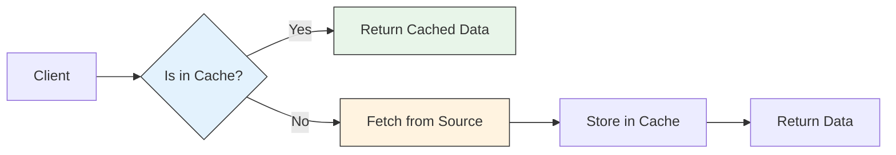

# 🗄️ Caching Strategies in Microservices

## 📌 Overview
Caching is a critical component in microservices architecture to improve performance, reduce latency, and decrease the load on backend services. This guide covers various caching strategies and their implementations in a microservices environment.



## 🎯 Why Use Caching?

| Benefit | Description | Example |
|---------|-------------|---------|
| **Performance** | Faster response times | Reduce DB load |
| **Scalability** | Handle more requests | Traffic spikes |
| **Cost Reduction** | Reduce database costs | Fewer DB instances |
| **Offline Access** | Function during outages | Read from cache |

## 🛠 Implementation Patterns

### 1. Cache-Aside (Lazy Loading)

```java
@Service
@RequiredArgsConstructor
public class ProductService {
    private final ProductRepository productRepository;
    private final CacheManager cacheManager;
    
    @Cacheable(value = "products", key = "#id")
    public Product getProduct(String id) {
        return productRepository.findById(id)
            .orElseThrow(() -> new ProductNotFoundException(id));
    }
    
    @CachePut(value = "products", key = "#product.id")
    public Product updateProduct(Product product) {
        return productRepository.save(product);
    }
    
    @CacheEvict(value = "products", key = "#id")
    public void deleteProduct(String id) {
        productRepository.deleteById(id);
    }
}
```

### 2. Write-Through Cache

```java
@Service
public class ProductService {
    
    @CachePut(value = "products", key = "#product.id")
    public Product createProduct(Product product) {
        // Write to cache and database
        return productRepository.save(product);
    }
    
    @Cacheable(value = "products", key = "#id")
    public Product getProduct(String id) {
        // If not in cache, loads from DB and caches
        return productRepository.findById(id)
            .orElseThrow(() -> new ProductNotFoundException(id));
    }
}
```

### 3. Write-Behind (Write-Back) Cache

```java
@Service
public class ProductService {
    
    @Async
    @CachePut(value = "products", key = "#product.id")
    public CompletableFuture<Product> updateProductAsync(Product product) {
        // Write to cache immediately
        // Asynchronously write to database
        return CompletableFuture.supplyAsync(() -> 
            productRepository.save(product)
        );
    }
}
```

## 🔄 Cache Invalidation Strategies

### 1. Time-to-Live (TTL)

```yaml
# application.yml
spring:
  cache:
    redis:
      time-to-live: 300000  # 5 minutes
```

### 2. Event-Based Invalidation

```java
@Service
@RequiredArgsConstructor
public class ProductEventListener {
    
    private final CacheManager cacheManager;
    
    @EventListener
    public void handleProductUpdate(ProductUpdatedEvent event) {
        // Invalidate cache when product is updated
        cacheManager.getCache("products").evict(event.getProductId());
    }
}
```

## 📊 Distributed Caching with Redis

### 1. Configuration

```yaml
# application.yml
spring:
  cache:
    type: redis
  redis:
    host: localhost
    port: 6379
    timeout: 2000
```

### 2. Redis Cache Configuration

```java
@Configuration
@EnableCaching
public class CacheConfig extends CachingConfigurerSupport {
    
    @Bean
    public RedisCacheManager cacheManager(RedisConnectionFactory connectionFactory) {
        RedisCacheConfiguration config = RedisCacheConfiguration.defaultCacheConfig()
            .entryTtl(Duration.ofMinutes(10))
            .disableCachingNullValues()
            .serializeValuesWith(RedisSerializationContext.SerializationPair
                .fromSerializer(new GenericJackson2JsonRedisSerializer()));
                
        return RedisCacheManager.builder(connectionFactory)
            .cacheDefaults(config)
            .build();
    }
}
```

## 🚀 Best Practices

1. **Cache Invalidation**
   - Implement proper cache invalidation
   - Use TTL as a safety net
   
2. **Cache Key Design**
   - Use consistent and unique keys
   - Include all relevant parameters in the key
   
3. **Monitoring**
   - Monitor cache hit/miss ratios
   - Set up alerts for high miss rates
   
4. **Cache Size**
   - Set appropriate cache size limits
   - Use LRU (Least Recently Used) eviction policy

## ⚠️ Common Pitfalls

| Pitfall | Solution |
|---------|----------|
| **Cache Inconsistency** | Use write-through or write-behind |
| **Cache Stampede** | Implement locking or backoff |
| **Memory Leaks** | Set TTL and size limits |
| **Cold Starts** | Pre-warm the cache |

## 📚 Related Patterns

- **CDN**: For static content caching
- **HTTP Caching**: For web resources
- **Database Caching**: For query results
- **Session Storage**: For user sessions

## 🔍 Further Reading

- [Spring Cache Abstraction](https://docs.spring.io/spring-framework/docs/current/reference/html/integration.html#cache)
- [Redis Caching Patterns](https://redis.io/topics/caching)
- [Cache-Aside Pattern](https://docs.microsoft.com/en-us/azure/architecture/patterns/cache-aside)
