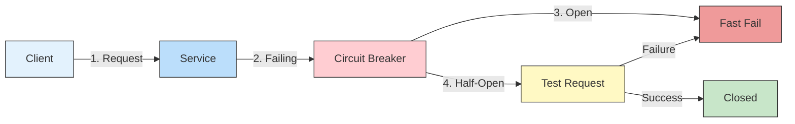

# ⚡ Circuit Breaker Pattern in Microservices

## 📌 Overview
The Circuit Breaker pattern is a design pattern used to detect failures and encapsulate the logic of preventing a failure from constantly recurring during maintenance, temporary external system failure, or unexpected system difficulties.



## 🎯 Why Use Circuit Breaker?

| Problem | Solution | Benefit |
|---------|----------|---------|
| Cascading Failures | Fail Fast | Prevents system overload |
| Long Timeouts | Fallback Responses | Better user experience |
| Resource Exhaustion | Circuit Breaking | Protects system resources |
| Slow Responses | Automatic Recovery | Self-healing system |

## 🏗️ States of Circuit Breaker

### 1. CLOSED (Normal Operation)
- Requests flow through normally
- Monitors for failures
- Moves to OPEN on failure threshold

### 2. OPEN (Fail Fast)
- Requests fail immediately
- No calls to the failing service
- After timeout, moves to HALF-OPEN

### 3. HALF-OPEN (Testing Recovery)
- Allows a test request
- On success, moves to CLOSED
- On failure, returns to OPEN

## 🛠️ Implementation with Resilience4j

### 1. Dependencies (`build.gradle`)
```gradle
dependencies {
    implementation 'io.github.resilience4j:resilience4j-spring-boot2:1.7.0'
    implementation 'org.springframework.boot:spring-boot-starter-aop'
    implementation 'io.github.resilience4j:resilience4j-circuitbreaker:1.7.0'
}
```

### 2. Configuration (`application.yml`)
```yaml
resilience4j.circuitbreaker:
  configs:
    default:
      registerHealthIndicator: true
      slidingWindowSize: 10
      permittedNumberOfCallsInHalfOpenState: 3
      slidingWindowType: COUNT_BASED
      minimumNumberOfCalls: 5
      waitDurationInOpenState: 5s
      failureRateThreshold: 50
  instances:
    orderService:
      baseConfig: default
    paymentService:
      baseConfig: default
      waitDurationInOpenState: 10s
```

### 3. Service Implementation
```java
@Service
public class OrderService {
    
    @CircuitBreaker(name = "orderService", fallbackMethod = "getOrderFallback")
    @RateLimiter(name = "orderService", fallbackMethod = "getOrderFallback")
    @Retry(name = "orderService", fallbackMethod = "getOrderFallback")
    public Order getOrder(String orderId) {
        // Business logic here
        return orderRepository.findById(orderId)
            .orElseThrow(() -> new OrderNotFoundException(orderId));
    }
    
    public Order getOrderFallback(String orderId, Exception e) {
        // Fallback logic
        return new Order(orderId, "Fallback Order", 0.0, "FALLBACK");
    }
}
```

## 🔄 Circuit Breaker with Feign Client

### 1. Feign Client Configuration
```java
@FeignClient(
    name = "payment-service",
    configuration = PaymentClientConfig.class,
    fallback = PaymentClientFallback.class
)
public interface PaymentClient {
    @PostMapping("/payments")
    PaymentResponse processPayment(PaymentRequest request);
}

@Component
public class PaymentClientFallback implements PaymentClient {
    @Override
    public PaymentResponse processPayment(PaymentRequest request) {
        return new PaymentResponse("FALLBACK", "Payment service is unavailable");
    }
}
```

### 2. Feign Configuration
```yaml
feign:
  circuitbreaker:
    enabled: true
  client:
    config:
      default:
        connectTimeout: 5000
        readTimeout: 5000
        loggerLevel: basic

resilience4j.circuitbreaker:
  instances:
    payment-service:
      registerHealthIndicator: true
      slidingWindowSize: 10
      permittedNumberOfCallsInHalfOpenState: 3
      slidingWindowType: COUNT_BASED
      minimumNumberOfCalls: 5
      waitDurationInOpenState: 10s
      failureRateThreshold: 50
```

## 📊 Monitoring with Actuator

### 1. Dependencies
```gradle
dependencies {
    implementation 'org.springframework.boot:spring-boot-starter-actuator'
    implementation 'io.micrometer:micrometer-registry-prometheus'
}
```

### 2. Application Properties
```yaml
management:
  endpoints:
    web:
      exposure:
        include: health,info,metrics,circuitbreakers
  endpoint:
    health:
      show-details: always
    circuitbreakers:
      enabled: true
```

### 3. Accessing Metrics
- Circuit Breaker State: `/actuator/health`
- Circuit Breaker Metrics: `/actuator/metrics/resilience4j.circuitbreaker.state`
- Prometheus Metrics: `/actuator/prometheus`

## 🏆 Best Practices

### 1. Configuration
- Set appropriate `failureRateThreshold` (e.g., 50-60%)
- Configure `waitDurationInOpenState` based on recovery time
- Use `slidingWindowSize` to control the number of calls for metrics

### 2. Fallback Strategies
- Return cached data
- Provide default values
- Queue requests for later processing
- Return meaningful error messages

### 3. Monitoring
- Track state transitions
- Monitor failure rates
- Set up alerts for open circuits
- Log circuit breaker events

### 4. Testing
- Test circuit opening/closing
- Verify fallback behavior
- Load test with failing dependencies
- Test recovery scenarios

## 🔄 Integration with Other Patterns

### 1. Retry Pattern
```java
@Retry(name = "orderService", 
       fallbackMethod = "fallback",
       maxAttempts = 3,
       waitDuration = 1000)
@CircuitBreaker(name = "orderService")
public Order getOrder(String id) {
    // Implementation
}
```

### 2. Bulkhead Pattern
```java
@Bulkhead(name = "orderService", 
          type = Bulkhead.Type.THREADPOOL,
          fallbackMethod = "bulkheadFallback")
@CircuitBreaker(name = "orderService")
public CompletableFuture<Order> getOrderAsync(String id) {
    // Async implementation
}
```

## 🚀 Example: E-commerce Checkout

### Order Service with Circuit Breaker
```java
@Service
@RequiredArgsConstructor
public class CheckoutService {
    
    private final PaymentClient paymentClient;
    private final InventoryClient inventoryClient;
    
    @CircuitBreaker(name = "checkoutService", 
                   fallbackMethod = "checkoutFallback")
    @TimeLimiter(name = "checkoutService")
    public CompletableFuture<CheckoutResponse> processCheckout(CheckoutRequest request) {
        // 1. Validate inventory
        inventoryClient.reserveItems(request.getItems());
        
        // 2. Process payment
        PaymentResponse payment = paymentClient.processPayment(
            new PaymentRequest(request.getOrderId(), request.getAmount()));
            
        // 3. Create order
        return CompletableFuture.completedFuture(
            new CheckoutResponse(payment.getStatus(), "Order processed"));
    }
    
    public CompletableFuture<CheckoutResponse> checkoutFallback(
        CheckoutRequest request, 
        Exception e) {
        
        return CompletableFuture.completedFuture(
            new CheckoutResponse("FALLBACK", 
                               "Checkout service is currently unavailable. Please try again later."));
    }
}
```

## 📚 Resources
- [Resilience4j Documentation](https://resilience4j.readme.io/)
- [Spring Cloud Circuit Breaker](https://spring.io/projects/spring-cloud-circuitbreaker)
- [Microservices Patterns](https://microservices.io/patterns/reliability/circuit-breaker.html)
- [Netflix Hystrix (Legacy)](https://github.com/Netflix/Hystrix)

## 🔗 Related Topics
- [Service Discovery](./SERVICE_DISCOVERY.md)
- [API Gateway](./API_GATEWAY.md)
- [Configuration Management](./CONFIG_SERVER.md)

---

[← Back to Main Learning Path](../README.md) | [Next: Service Mesh →]()
