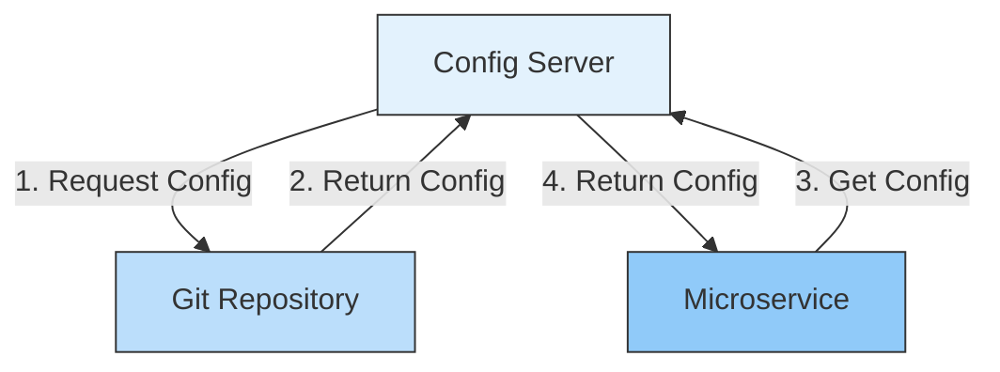
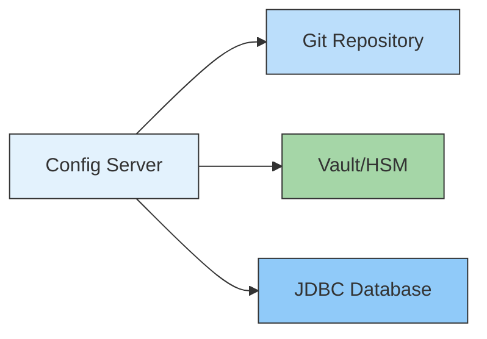
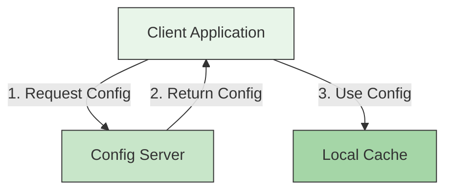

# ⚙️ Centralized Configuration with Spring Cloud Config

## 📌 Overview
A Config Server provides centralized configuration management for distributed systems, allowing you to manage configuration across multiple environments (dev, test, prod) from a single source of truth.



## 🎯 Why Use a Config Server?

| Challenge | Solution | Benefit |
|-----------|----------|---------|
| Configuration sprawl | Centralized config | Single source of truth |
| Environment-specific settings | Profiles | Consistent deployment |
| Sensitive data | Encryption at rest | Enhanced security |
| Configuration changes | Push notifications | No restarts needed |
| Version control | Git integration | Change tracking & rollback |

## 🏗️ Architecture

### 1. Server-Side Components



### 2. Client-Side Integration



## 🛠️ Implementation Guide

### 1. Config Server Setup

#### Dependencies (`build.gradle`)
```gradle
dependencies {
    implementation 'org.springframework.cloud:spring-cloud-config-server'
    implementation 'org.springframework.boot:spring-boot-starter-security'
    implementation 'org.springframework.cloud:spring-cloud-starter-bus-amqp'
}
```

#### Application Class
```java
@SpringBootApplication
@EnableConfigServer
public class ConfigServerApplication {
    public static void main(String[] args) {
        SpringApplication.run(ConfigServerApplication.class, args);
    }
}
```

#### Configuration (`application.yml`)
```yaml
server:
  port: 8888

spring:
  application:
    name: config-server
  cloud:
    config:
      server:
        git:
          uri: https://github.com/your-org/config-repo
          username: ${GIT_USERNAME}
          password: ${GIT_PASSWORD}
          default-label: main
          clone-on-start: true
          search-paths: '{application}'
  security:
    user:
      name: admin
      password: ${CONFIG_SERVER_PASSWORD}

management:
  endpoints:
    web:
      exposure:
        include: health,info,refresh,bus-refresh
```

### 2. Client Application Setup

#### Dependencies (`build.gradle`)
```gradle
dependencies {
    implementation 'org.springframework.cloud:spring-cloud-starter-config'
    implementation 'org.springframework.boot:spring-boot-starter-actuator'
    implementation 'org.springframework.cloud:spring-cloud-starter-bus-amqp'
}
```

#### Bootstrap Configuration (`bootstrap.yml`)
```yaml
spring:
  application:
    name: order-service
  profiles:
    active: dev
  cloud:
    config:
      uri: http://localhost:8888
      username: admin
      password: ${CONFIG_SERVER_PASSWORD}
      fail-fast: true
      retry:
        initial-interval: 1000
        max-interval: 2000
        max-attempts: 6
        multiplier: 1.1

management:
  endpoints:
    web:
      exposure:
        include: refresh,health,info
```

## 🔄 Configuration Refresh

### 1. Manual Refresh
```bash
# Send POST request to refresh config
curl -X POST http://localhost:8080/actuator/refresh
```

### 2. Automatic Refresh with Spring Cloud Bus
```yaml
# application.yml
spring:
  rabbitmq:
    host: localhost
    port: 5672
    username: guest
    password: guest

management:
  endpoints:
    web:
      exposure:
        include: bus-refresh
```

## 🔐 Security & Encryption

### 1. Encrypting Sensitive Data
```bash
# Encrypt a secret value
curl -X POST http://localhost:8888/encrypt -d "my-secret-value"

# Decrypt a value
curl -X POST http://localhost:8888/decrypt -d "{cipher}encrypted-value"
```

### 2. Using Vault for Secrets
```yaml
# bootstrap.yml
spring:
  cloud:
    config:
      server:
        vault:
          host: 127.0.0.1
          port: 8200
          scheme: http
          kv-version: 2
          authentication: TOKEN
          token: ${VAULT_TOKEN}
```

## 🏗️ Repository Structure

```
config-repo/
├── order-service/
│   ├── application.yml          # Shared config
│   ├── application-dev.yml      # Dev environment
│   ├── application-prod.yml     # Production config
│   └── application-test.yml     # Test config
├── payment-service/
│   ├── application.yml
│   └── application-prod.yml
└── application.yml              # Global config
```

## 🚀 Deployment Strategies

### 1. High Availability Setup
```yaml
# docker-compose.yml
version: '3.8'
services:
  config-server-1:
    image: myapp/config-server:latest
    ports:
      - "8888:8888"
    environment:
      - SPRING_PROFILES_ACTIVE=ha
      - SPRING_RABBITMQ_HOST=rabbitmq
      - SPRING_CLOUD_CONFIG_SERVER_GIT_URI=https://github.com/your-org/config-repo

  config-server-2:
    image: myapp/config-server:latest
    ports:
      - "8889:8888"
    environment:
      - SPRING_PROFILES_ACTIVE=ha
      - SPRING_RABBITMQ_HOST=rabbitmq
      - SPRING_CLOUD_CONFIG_SERVER_GIT_URI=https://github.com/your-org/config-repo

  rabbitmq:
    image: rabbitmq:3-management
    ports:
      - "5672:5672"
      - "15672:15672"
```

### 2. Kubernetes Deployment
```yaml
# config-server-deployment.yaml
apiVersion: apps/v1
kind: Deployment
metadata:
  name: config-server
  labels:
    app: config-server
spec:
  replicas: 3
  selector:
    matchLabels:
      app: config-server
  template:
    metadata:
      labels:
        app: config-server
    spec:
      containers:
      - name: config-server
        image: myapp/config-server:latest
        ports:
        - containerPort: 8888
        env:
        - name: SPRING_PROFILES_ACTIVE
          value: "kubernetes"
        - name: SPRING_CLOUD_CONFIG_SERVER_GIT_URI
          value: "https://github.com/your-org/config-repo"
        livenessProbe:
          httpGet:
            path: /actuator/health
            port: 8888
          initialDelaySeconds: 30
          periodSeconds: 10
---
apiVersion: v1
kind: Service
metadata:
  name: config-server
spec:
  selector:
    app: config-server
  ports:
  - protocol: TCP
    port: 80
    targetPort: 8888
  type: ClusterIP
```

## 🏆 Best Practices

### 1. Security
- Enable HTTPS for all communications
- Use Vault or AWS KMS for secrets management
- Implement proper authentication and authorization
- Rotate encryption keys regularly

### 2. Performance
- Enable client-side caching
- Use composite environments for high availability
- Implement retry mechanisms

### 3. Operations
- Version control all configurations
- Use profiles for environment-specific settings
- Monitor config server health
- Set up alerts for failed refreshes

### 4. Development
- Use local overrides for development
- Document all configuration properties
- Validate configurations on startup

## 📚 Resources
- [Spring Cloud Config](https://spring.io/projects/spring-cloud-config)
- [HashiCorp Vault](https://www.vaultproject.io/)
- [12 Factor App Config](https://12factor.net/config)
- [Kubernetes ConfigMaps & Secrets](https://kubernetes.io/docs/concepts/configuration/)

## 🔗 Related Projects
- [Service Discovery](./SERVICE_DISCOVERY.md)
- [API Gateway](./API_GATEWAY.md)
- [Spring Cloud Bus](https://spring.io/projects/spring-cloud-bus)

---

[← Back to Main Learning Path](../README.md) | [Next: Circuit Breaker →]()
