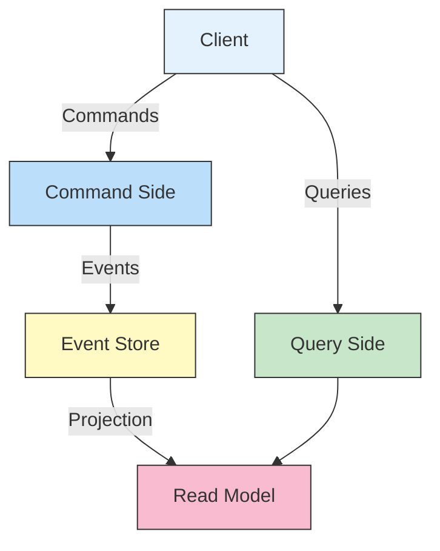
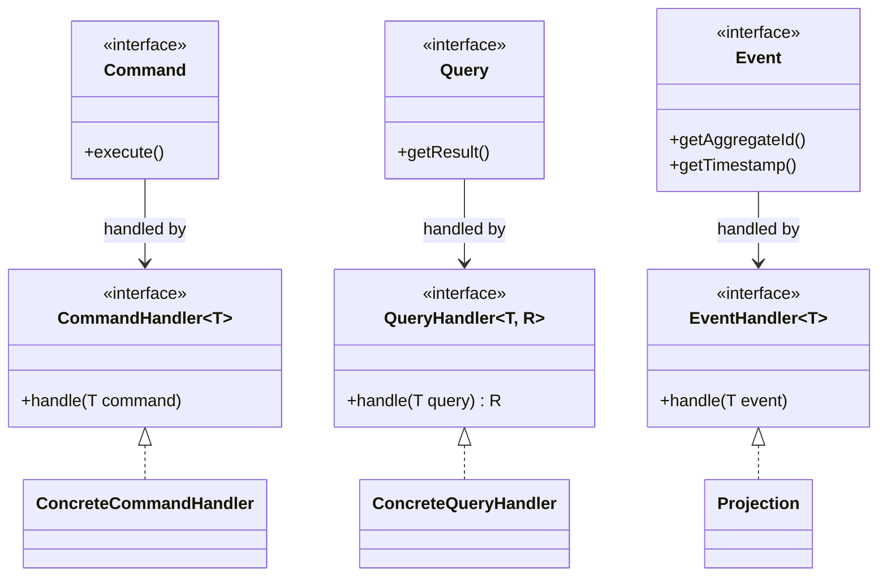

# 🏛️ CQRS Pattern in Microservices

## 📌 Overview
Command Query Responsibility Segregation (CQRS) is an architectural pattern that separates read and write operations into different models, allowing them to be optimized independently for better performance, scalability, and maintainability.



## 🎯 Why Use CQRS?

| Problem | CQRS Solution | Benefit |
|---------|--------------|---------|
| Complex domain models | Separate read/write models | Simplified models |
| High read/write ratio | Independent scaling | Better performance |
| Complex queries | Optimized read models | Faster queries |
| Performance bottlenecks | Different storage technologies | Optimized storage |
| Event sourcing integration | Natural fit | Better audit trail |

## 🏗️ CQRS Architecture

### 1. Command Side (Write Model)
- Handles commands (intent to change state)
- Enforces business rules
- Generates events
- Typically uses domain-driven design

### 2. Query Side (Read Model)
- Handles queries (read operations)
- Denormalized data views
- Optimized for reading
- Can use different storage technology

### 3. Synchronization
- Event-driven updates
- Eventual consistency
- Projections to update read models



## 🛠️ Implementation with Spring Boot

### 1. Dependencies (`build.gradle`)
```gradle
dependencies {
    implementation 'org.axonframework:axon-spring-boot-starter:4.5.13'
    implementation 'org.springframework.boot:spring-boot-starter-data-jpa'
    implementation 'com.h2database:h2'
    implementation 'org.projectlombok:lombok'
    annotationProcessor 'org.projectlombok:lombok'
}
```

### 2. Command Side Implementation

#### Command
```java
public class CreateOrderCommand {
    @TargetAggregateIdentifier
    private final String orderId;
    private final String productId;
    private final int quantity;
    private final String userId;
    
    // Constructor, getters
}
```

#### Aggregate
```java
@Aggregate
@NoArgsConstructor
public class OrderAggregate {
    @AggregateIdentifier
    private String orderId;
    private OrderStatus status;
    
    @CommandHandler
    public OrderAggregate(CreateOrderCommand command) {
        // Validate command
        AggregateLifecycle.apply(new OrderCreatedEvent(
            command.getOrderId(),
            command.getProductId(),
            command.getQuantity(),
            command.getUserId()
        ));
    }
    
    @EventSourcingHandler
    public void on(OrderCreatedEvent event) {
        this.orderId = event.getOrderId();
        this.status = OrderStatus.CREATED;
    }
    
    @CommandHandler
    public void handle(ShipOrderCommand command) {
        if (this.status != OrderStatus.CREATED) {
            throw new IllegalStateException("Order must be in CREATED state");
        }
        AggregateLifecycle.apply(new OrderShippedEvent(command.getOrderId()));
    }
    
    @EventSourcingHandler
    public void on(OrderShippedEvent event) {
        this.status = OrderStatus.SHIPPED;
    }
}
```

### 3. Query Side Implementation

#### Read Model
```java
@Entity
@Table(name = "order_summary")
@Data
@NoArgsConstructor
public class OrderSummary {
    @Id
    private String orderId;
    private String productId;
    private int quantity;
    private String userId;
    private OrderStatus status;
    private LocalDateTime createdDate;
    
    public OrderSummary(String orderId, String productId, int quantity, 
                       String userId, OrderStatus status) {
        this.orderId = orderId;
        this.productId = productId;
        this.quantity = quantity;
        this.userId = userId;
        this.status = status;
        this.createdDate = LocalDateTime.now();
    }
}
```

#### Query Handler
```java
@ProcessingGroup("order-summary")
@RequiredArgsConstructor
public class OrderSummaryProjection {
    
    private final OrderSummaryRepository repository;
    
    @EventHandler
    public void on(OrderCreatedEvent event) {
        OrderSummary summary = new OrderSummary(
            event.getOrderId(),
            event.getProductId(),
            event.getQuantity(),
            event.getUserId(),
            OrderStatus.CREATED
        );
        repository.save(summary);
    }
    
    @EventHandler
    public void on(OrderShippedEvent event) {
        OrderSummary summary = repository.findById(event.getOrderId())
            .orElseThrow(() -> new OrderNotFoundException(event.getOrderId()));
        summary.setStatus(OrderStatus.SHIPPED);
        repository.save(summary);
    }
    
    @QueryHandler
    public List<OrderSummary> handle(FindAllOrderedProductsQuery query) {
        return repository.findAll();
    }
}
```

## 🔄 CQRS with Event Sourcing

### Event Store Configuration
```java
@Configuration
public class AxonConfig {
    
    @Bean
    public EventStorageEngine eventStorageEngine(EntityManager entityManager) {
        return new JpaEventStorageEngine(
            new SpringEntityManagerProvider(entityManager)
        );
    }
    
    @Bean
    public EventSourcingRepository<OrderAggregate> orderAggregateRepository(
            EventStore eventStore) {
        return EventSourcingRepository.builder(OrderAggregate.class)
            .eventStore(eventStore)
            .build();
    }
}
```

### Rebuilding Read Models
```java
@Service
@RequiredArgsConstructor
public class ReadModelRebuilder {
    
    private final EventStore eventStore;
    private final OrderSummaryProjection projection;
    
    @Scheduled(fixedRate = 3600000) // Every hour
    public void rebuildReadModel() {
        eventStore.readEvents(OrderAggregate.class.getSimpleName())
            .asStream()
            .forEach(event -> {
                try {
                    projection.on((DomainEventMessage<?>) event);
                } catch (Exception e) {
                    // Handle error
                }
            });
    }
}
```

## 🏆 Best Practices

### 1. Bounded Contexts
- Define clear boundaries for each context
- Use separate databases per context
- Implement context mapping

### 2. Eventual Consistency
- Design for eventual consistency
- Use compensating transactions
- Implement idempotent handlers

### 3. Performance
- Use read replicas for scaling reads
- Implement caching for frequent queries
- Consider materialized views

### 4. Testing
- Test command and query sides independently
- Verify event sourcing behavior
- Test eventual consistency
- Performance test read models

## 🌟 CQRS Variations

### 1. Simple CQRS
- Separate read/write models in same application
- Shared database with different models
- Simpler to implement

### 2. Distributed CQRS
- Separate services for commands and queries
- Event-driven communication
- Independent scaling

### 3. CQRS with Event Sourcing
- Events as source of truth
- Complete audit trail
- Time-travel debugging

## 🚀 Example: E-Commerce System

### Command Side (Write Model)
```java
@RestController
@RequestMapping("/api/orders")
@RequiredArgsConstructor
public class OrderCommandController {
    
    private final CommandGateway commandGateway;
    
    @PostMapping
    public CompletableFuture<String> createOrder(@RequestBody CreateOrderRequest request) {
        String orderId = UUID.randomUUID().toString();
        return commandGateway.send(new CreateOrderCommand(
            orderId,
            request.getProductId(),
            request.getQuantity(),
            request.getUserId()
        )).thenApply(v -> orderId);
    }
    
    @PostMapping("/{orderId}/ship")
    public CompletableFuture<Void> shipOrder(@PathVariable String orderId) {
        return commandGateway.send(new ShipOrderCommand(orderId));
    }
}
```

### Query Side (Read Model)
```java
@RestController
@RequestMapping("/api/orders")
@RequiredArgsConstructor
public class OrderQueryController {
    
    private final OrderSummaryRepository repository;
    
    @GetMapping
    public List<OrderSummary> getAllOrders() {
        return repository.findAll();
    }
    
    @GetMapping("/{orderId}")
    public OrderSummary getOrder(@PathVariable String orderId) {
        return repository.findById(orderId)
            .orElseThrow(() -> new OrderNotFoundException(orderId));
    }
    
    @GetMapping("/user/{userId}")
    public List<OrderSummary> getUserOrders(@PathVariable String userId) {
        return repository.findByUserId(userId);
    }
}
```

### Event Handlers
```java
@ProcessingGroup("order-summary")
@RequiredArgsConstructor
public class OrderSummaryProjection {
    
    private final OrderSummaryRepository repository;
    private final QueryUpdateEmitter updateEmitter;
    
    @EventHandler
    public void on(OrderCreatedEvent event) {
        OrderSummary summary = new OrderSummary(
            event.getOrderId(),
            event.getProductId(),
            event.getQuantity(),
            event.getUserId(),
            OrderStatus.CREATED
        );
        repository.save(summary);
        
        // Emit update for subscription queries
        updateEmitter.emit(FindAllOrderedProductsQuery.class, 
            query -> true, 
            summary);
    }
    
    @QueryHandler
    public List<OrderSummary> handle(FindAllOrderedProductsQuery query) {
        return repository.findAll();
    }
    
    @QueryHandler
    public OrderSummary handle(FindOrderQuery query) {
        return repository.findById(query.getOrderId())
            .orElseThrow(() -> new OrderNotFoundException(query.getOrderId()));
    }
}
```

## 📚 Resources
- [CQRS Pattern - Microsoft Docs](https://docs.microsoft.com/en-us/azure/architecture/patterns/cqrs)
- [Axon Framework Documentation](https://docs.axoniq.io/)
- [CQRS Journey - Microsoft Patterns & Practices](https://learn.microsoft.com/en-us/previous-versions/msp-n-p/jj554200(v=pandp.10))
- [Event Sourcing and CQRS](https://martinfowler.com/eaaDev/EventSourcing.html)

## 🔗 Related Topics
- [Event-Driven Architecture](./EVENT_DRIVEN_ARCHITECTURE.md)
- [Saga Pattern](./SAGA_PATTERN.md)
- [Domain-Driven Design](./DOMAIN_DRIVEN_DESIGN.md)

---

[← Back to Main Learning Path](../README.md) | [Next: Saga Pattern →]()
