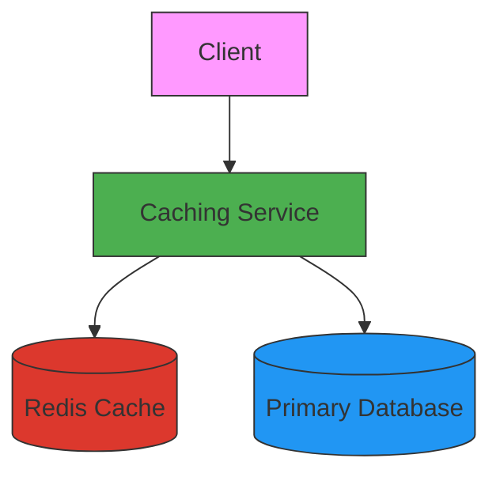

# 🗄️ Caching Service

[](https://www.oracle.com/java/)
[](https://spring.io/projects/spring-boot)
[](https://redis.io/)
[](https://www.docker.com/)
[](https://opensource.org/licenses/MIT)

A high-performance caching service implementation using Spring Boot and Redis, demonstrating various caching patterns and strategies for microservices.

## 🚀 Features

- **Multiple Caching Strategies**: Cache-Aside, Read-Through, Write-Through, Write-Behind
- **Redis Integration**: Distributed caching with Redis
- **Cache Invalidation**: Time-based and manual cache eviction
- **Metrics**: Cache hit/miss statistics
- **Containerized**: Easy deployment with Docker Compose
- **API Documentation**: Interactive Swagger UI

## 🌟 Quick Start

1. **Prerequisites**
   - Java 17+
   - Docker & Docker Compose
   - Gradle 8.0+

2. **Run with Docker Compose**
   ```bash
   docker-compose up -d
   ```

3. **Access Services**
   - Caching Service: http://localhost:8080
   - API Documentation: http://localhost:8080/swagger-ui.html
   - Redis Commander (Web UI): http://localhost:8081

## 🏗️ System Architecture



## 📚 Caching Patterns

### 1. Cache-Aside (Lazy Loading)
```java
@Cacheable(value = "products", key = "#id")
public Product getProduct(String id) {
    return productRepository.findById(id)
        .orElseThrow(() -> new ProductNotFoundException(id));
}
```

### 2. Write-Through
```java
@CachePut(value = "products", key = "#product.id")
public Product updateProduct(Product product) {
    return productRepository.save(product);
}
```

### 3. Write-Behind (Write-Back)
```java
@Async
@CachePut(value = "products", key = "#product.id")
public CompletableFuture<Product> updateProductAsync(Product product) {
    return CompletableFuture.supplyAsync(() -> 
        productRepository.save(product)
    );
}
```

## 🛠️ Configuration

### Redis Configuration
```yaml
spring:
  cache:
    type: redis
    redis:
      time-to-live: 300000  # 5 minutes
  redis:
    host: localhost
    port: 6379
    timeout: 2000
```

### Cache Configuration
```java
@Configuration
@EnableCaching
public class CacheConfig extends CachingConfigurerSupport {
    
    @Bean
    public RedisCacheManager cacheManager(RedisConnectionFactory connectionFactory) {
        RedisCacheConfiguration config = RedisCacheConfiguration.defaultCacheConfig()
            .entryTtl(Duration.ofMinutes(10))
            .disableCachingNullValues()
            .serializeValuesWith(RedisSerializationContext.SerializationPair
                .fromSerializer(new GenericJackson2JsonRedisSerializer()));
                
        return RedisCacheManager.builder(connectionFactory)
            .cacheDefaults(config)
            .build();
    }
}
```

## 🧪 Testing the Service

1. **Create a Product**
   ```bash
   curl -X POST "http://localhost:8080/api/products" \
   -H "Content-Type: application/json" \
   -d '{"name":"Laptop","price":999.99}'
   ```

2. **Get Product (Cached)**
   ```bash
   curl "http://localhost:8080/api/products/1"
   ```

3. **Update Product**
   ```bash
   curl -X PUT "http://localhost:8080/api/products/1" \
   -H "Content-Type: application/json" \
   -d '{"name":"Gaming Laptop","price":1299.99}'
   ```

4. **Clear Cache**
   ```bash
   curl -X DELETE "http://localhost:8080/api/cache/products/1"
   ```

## 🧩 Project Structure

```
Caching/
├── src/
│   ├── main/
│   │   ├── java/com/example/caching/
│   │   │   ├── config/          # Configuration classes
│   │   │   ├── controller/      # REST controllers
│   │   │   ├── model/           # Domain models
│   │   │   ├── repository/      # Data access layer
│   │   │   ├── service/         # Business logic
│   │   │   └── CachingApplication.java
│   │   └── resources/
│   │       ├── application.yml  # Configuration
│   │       └── data.sql         # Initial data
│   └── test/                    # Test cases
├── docker-compose.yml           # Docker Compose configuration
└── build.gradle                 # Build configuration
```

## 🚀 Deployment

### Local Development
```bash
./gradlew bootRun
```

### Build Docker Image
```bash
docker build -t caching-service .
```

### Run with Docker Compose
```bash
docker-compose up -d
```

## 📊 Monitoring

### Cache Statistics
- Access metrics at: `http://localhost:8080/actuator/caches`
- View cache hit/miss ratios in Prometheus format

### Redis Monitoring
- Use Redis Commander: `http://localhost:8081`
- Monitor memory usage and connected clients

## 📚 Learning Resources

- [Spring Cache Abstraction](https://docs.spring.io/spring-framework/docs/current/reference/html/integration.html#cache)
- [Redis Documentation](https://redis.io/documentation)
- [Caching Patterns](https://docs.microsoft.com/en-us/azure/architecture/patterns/caching)

## 📄 License

This project is licensed under the MIT License - see the [LICENSE](LICENSE) file for details.
