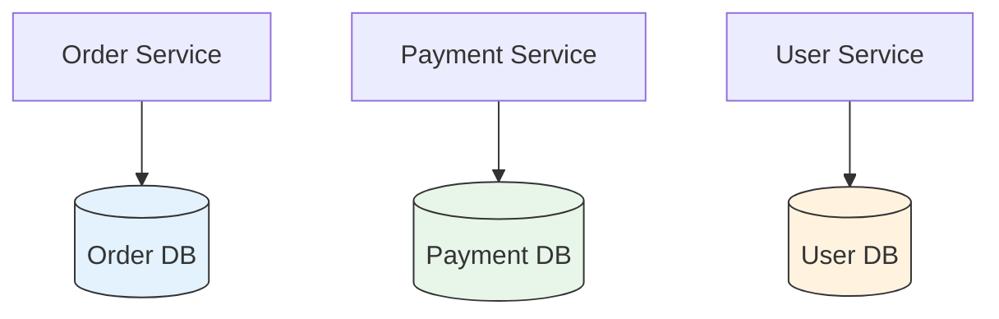

# 🗃️ Database per Service Pattern

## 📌 Overview
The Database per Service pattern is a fundamental microservices pattern where each service has its own dedicated database, ensuring loose coupling between services. This approach allows each service to choose the most appropriate database technology for its specific needs.



## 🎯 Why Use Database per Service?

| Benefit | Description | Example |
|---------|-------------|---------|
| **Loose Coupling** | Services are independent and can evolve separately | Change Order DB schema without affecting Payment service |
| **Technology Flexibility** | Choose the best database for each service | SQL for transactions, NoSQL for documents |
| **Scalability** | Scale databases independently based on load | Scale User DB separately from Product DB |
| **Fault Isolation** | Database failures are contained | Payment DB failure doesn't affect Order service |
| **Team Autonomy** | Teams can manage their own databases | Order team manages their own schema changes |

## 🛠 Implementation

### 1. Service-Specific Databases

```java
// Order Service - Using JPA with H2
@Entity
public class Order {
    @Id
    private String orderId;
    private String customerId;
    private BigDecimal amount;
    private OrderStatus status;
    
    // Getters and Setters
}

// Payment Service - Using MongoDB
@Document
public class Payment {
    @Id
    private String paymentId;
    private String orderId;
    private BigDecimal amount;
    private PaymentStatus status;
    
    // Getters and Setters
}
```

### 2. Database Configuration

```yaml
# application-order.yml
spring:
  datasource:
    url: jdbc:h2:mem:orderdb
    username: sa
    password: 
  jpa:
    hibernate:
      ddl-auto: update
    show-sql: true

# application-payment.yml
spring:
  data:
    mongodb:
      host: localhost
      port: 27017
      database: paymentdb
```

## 🔄 Data Consistency

### 1. Eventual Consistency

```java
// Order Service
@Transactional
public void createOrder(Order order) {
    orderRepository.save(order);
    eventPublisher.publishEvent(new OrderCreatedEvent(order.getOrderId(), order.getAmount()));
}

// Payment Service
@EventListener
public void handleOrderCreated(OrderCreatedEvent event) {
    Payment payment = new Payment();
    payment.setOrderId(event.getOrderId());
    payment.setAmount(event.getAmount());
    payment.setStatus(PaymentStatus.PENDING);
    paymentRepository.save(payment);
}
```

### 2. Saga Pattern for Distributed Transactions

```java
// Order Service - Start Saga
@Saga
public class OrderSaga {
    
    @StartSaga
    @SagaEventHandler(associationProperty = "orderId")
    public void handle(OrderCreatedEvent event) {
        // Start payment process
        commandGateway.send(new ProcessPaymentCommand(
            event.getOrderId(), 
            event.getAmount()
        ));
    }
    
    @SagaEventHandler(associationProperty = "orderId")
    public void handle(PaymentProcessedEvent event) {
        // Update order status
        commandGateway.send(new ApproveOrderCommand(
            event.getOrderId()
        ));
    }
}
```

## 🚀 Best Practices

1. **Database Selection**
   - Choose the right database for each service's needs
   - Consider consistency, availability, and partition tolerance (CAP theorem)

2. **Schema Management**
   - Use database migration tools (Flyway, Liquibase)
   - Version your database schemas

3. **Data Access**
   - Keep database access within the service boundary
   - Use DTOs for cross-service communication

4. **Caching**
   - Implement caching to reduce database load
   - Use distributed caches for shared data

5. **Monitoring**
   - Monitor database performance metrics
   - Set up alerts for slow queries or connection issues

## ⚠️ Challenges

| Challenge | Solution |
|-----------|----------|
| **Distributed Transactions** | Use Saga pattern or Event Sourcing |
| **Data Duplication** | Implement event-driven updates |
| **Cross-Service Queries** | Use API Composition or CQRS |
| **Data Consistency** | Implement eventual consistency |

## 📚 Related Patterns

- **Saga Pattern**: For managing distributed transactions
- **CQRS**: For separating read and write operations
- **Event Sourcing**: For maintaining state changes as a sequence of events
- **API Composition**: For querying data from multiple services

## 🔍 Further Reading

- [Pattern: Database per Service](https://microservices.io/patterns/data/database-per-service.html)
- [Saga Pattern](https://microservices.io/patterns/data/saga.html)
- [Domain-Driven Design](https://dddcommunity.org/)
