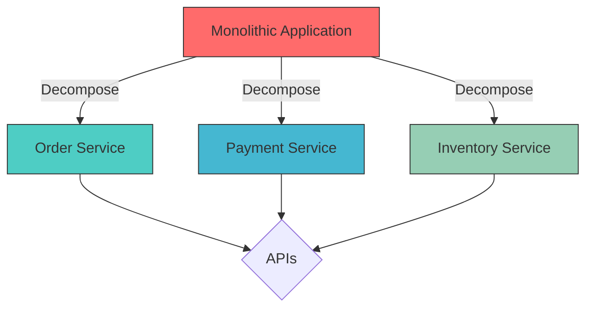
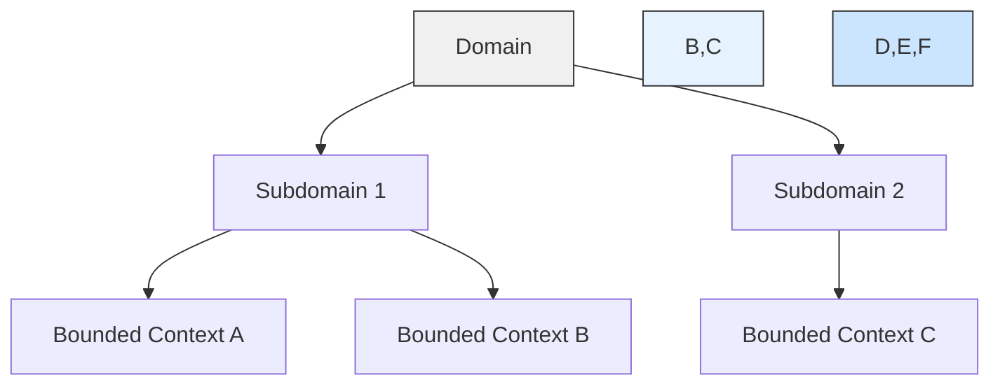
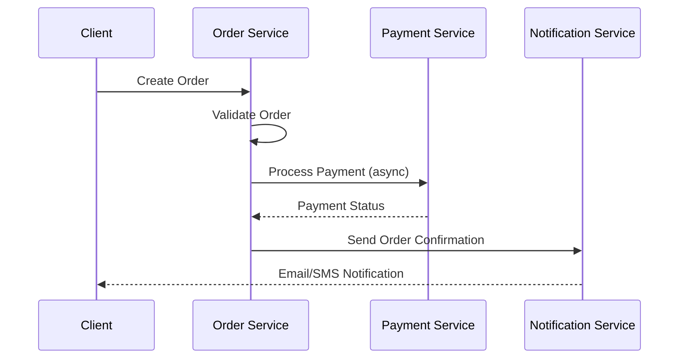
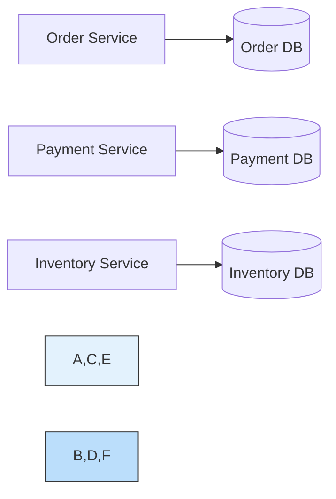
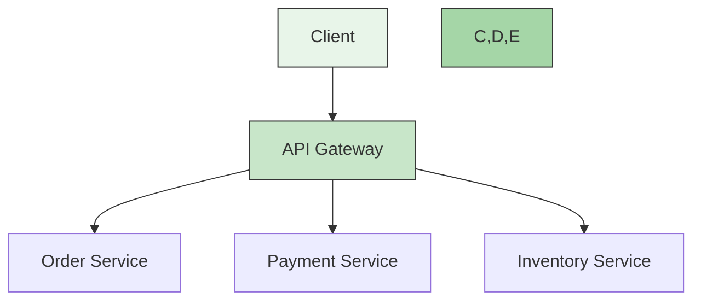
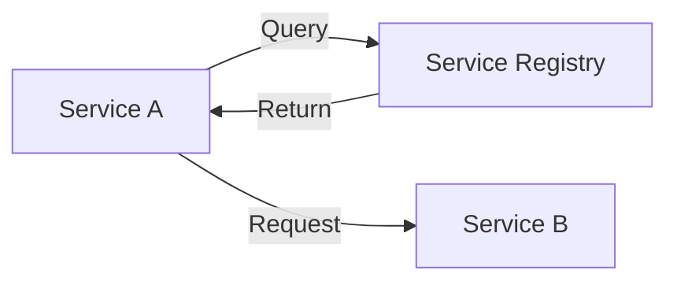
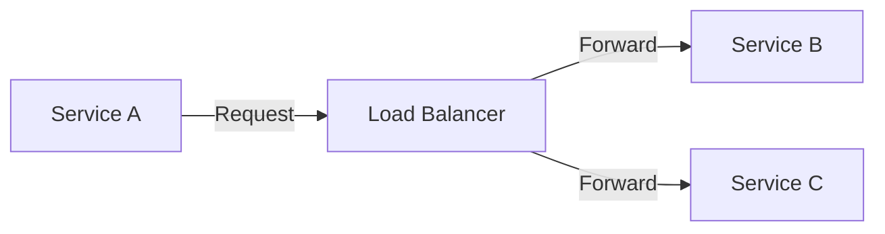

# 🧩 Service Decomposition in Microservices

## 🌟 Overview
Service decomposition is the process of breaking down a monolithic application into smaller, independent services that work together. This guide provides a comprehensive look at strategies, patterns, and best practices for effective service decomposition in microservices architecture.

## 🎯 Why Decompose?

| Benefit | Description | Example |
|---------|-------------|---------|
| **Independent Scaling** | Scale services based on their specific load | Scale payment service during high traffic |
| **Team Autonomy** | Teams can develop, test, and deploy independently | Frontend team works on UI while backend works on APIs |
| **Technology Flexibility** | Choose the right tool for each service | Use Node.js for real-time features, Java for business logic |
| **Fault Isolation** | Failures are contained within a single service | Payment service down doesn't affect product catalog |
| **Easier Maintenance** | Smaller, focused codebases | Update order logic without touching payment code |
| **Faster Deployment** | Deploy services independently | Deploy inventory updates without taking down checkout |

## 🔍 Decomposition Strategies

### 1. Domain-Driven Design (DDD) Approach

- **Bounded Contexts**: 
  - Define clear boundaries around specific business capabilities
  - Example: `OrderContext`, `PaymentContext`, `InventoryContext`
- **Ubiquitous Language**:
  - Develop a common language between developers and domain experts
  - Example: 'Order' means the same thing across all contexts
- **Aggregate Roots**:
  - Define transaction and consistency boundaries
  - Example: `Order` aggregate root manages all order-related operations

### 2. Business Capability Decomposition

| Business Capability | Potential Services |
|---------------------|-------------------|
| Order Management | Order Service |
| Payment Processing | Payment Service |
| Inventory Management | Inventory Service |
| Customer Management | Customer Service |
| Shipping | Shipping Service |

### 3. Transactional Boundaries

| Pattern | Description | Use Case |
|---------|-------------|----------|
| **Saga Pattern** | Long-lived transactions split into local transactions | Order processing across services |
| **Two-Phase Commit** | Distributed transaction protocol | When strong consistency is required |
| **Event Sourcing** | Store state changes as a sequence of events | Audit trails, complex business workflows |

## 🛠️ Practical Example: Order & Payment System

### Service Architecture

### Service Responsibilities

#### 🛒 Order Service
- **Core Functions**:
  - Order creation and validation
  - Order status management
  - Inventory reservation
- **Key Operations**:
  - `POST /orders` - Create new order
  - `GET /orders/{id}` - Get order details
  - `PATCH /orders/{id}/status` - Update order status

#### 💳 Payment Service
- **Core Functions**:
  - Payment processing
  - Transaction management
  - Payment status tracking
- **Key Operations**:
  - `POST /payments` - Process payment
  - `GET /payments/{id}` - Get payment status
  - `POST /refunds` - Process refund

### Communication Patterns

| Pattern | Technology | When to Use |
|---------|------------|-------------|
| **Synchronous** | REST/HTTP, gRPC | When immediate response is needed |
| **Asynchronous** | Kafka, RabbitMQ | For background processing |
| **Event-Driven** | Event Sourcing, CQRS | Complex workflows, audit trails |

## 🏗️ Implementation Patterns & Technologies

### 1. Database per Service

**Benefits**:
- Data autonomy for each service
- Independent schema evolution
- Service-specific database optimization

**Challenges**:
- Distributed transactions
- Data consistency
- Cross-service queries

### 2. API Gateway Pattern

**Features**:
- Request routing
- Authentication & Authorization
- Rate limiting
- Response caching
- Load balancing

**Technologies**:
- Spring Cloud Gateway
- Kong
- AWS API Gateway
- Nginx

### 3. Service Discovery

**Client-Side Discovery**:

**Server-Side Discovery**:

**Popular Tools**:
- Eureka (Netflix)
- Consul (HashiCorp)
- etcd
- ZooKeeper

## ⚠️ Common Challenges & Solutions

### 1. Data Consistency

**Challenge**: Maintaining consistency across services

**Solutions**:
- **Saga Pattern**: Break transactions into local transactions with compensating actions
- **Event Sourcing**: Store state changes as a sequence of events
- **CQRS**: Separate read and write operations

### 2. Service Discovery

**Challenge**: Services need to find and communicate with each other

**Solutions**:
- **Service Registry**: Central registry of available service instances
- **Client-Side Load Balancing**: Distribute load across service instances
- **Health Checks**: Automatically detect and route around failed instances

### 3. Distributed Transactions

**Challenge**: Coordinating transactions across multiple services

**Solutions**:
- **Two-Phase Commit (2PC)**: For strong consistency
- **Saga Pattern**: For long-running transactions
- **Compensating Transactions**: To undo previous operations

### 4. Testing

**Challenge**: Testing interactions between services

**Solutions**:
- **Contract Testing**: Verify service contracts
- **Service Virtualization**: Mock external dependencies
- **Consumer-Driven Contracts**: Define expected behavior between services

### 5. Monitoring & Observability

**Challenge**: Debugging distributed systems

**Solutions**:
- **Distributed Tracing**: Track requests across services
- **Centralized Logging**: Aggregate logs from all services
- **Metrics Collection**: Monitor service health and performance

## 📚 Recommended Resources

### Books
- [Building Microservices](https://www.oreilly.com/library/view/building-microservices/9781491950340/) by Sam Newman
- [Domain-Driven Design](https://www.oreilly.com/library/view/domain-driven-design-tackling/0321125215/) by Eric Evans
- [Microservices Patterns](https://www.manning.com/books/microservices-patterns) by Chris Richardson

### Online Resources
- [Microservices.io](https://microservices.io/) - Patterns and best practices
- [Martin Fowler on Microservices](https://martinfowler.com/microservices/)
- [Microsoft Cloud Design Patterns](https://docs.microsoft.com/en-us/azure/architecture/patterns/)

## 🛠️ Hands-on Exercise

### Exercise 1: Service Identification
1. Take a simple e-commerce system and identify potential microservices
2. Define clear boundaries and responsibilities for each service
3. Map out the communication patterns between services

### Exercise 2: Database Design
1. Design the database schema for each service
2. Identify potential data consistency challenges
3. Propose solutions for maintaining data consistency

### Exercise 3: Implementation Planning
1. Choose appropriate technologies for each service
2. Design the API contracts
3. Plan the deployment strategy

## 🏆 Best Practices Summary

### Design Phase
- Start with broader service boundaries
- Define clear domain models
- Establish communication patterns early

### Development Phase
- Implement API versioning from day one
- Use contract testing
- Document all service interfaces

### Operations
- Implement comprehensive monitoring
- Set up centralized logging
- Plan for failure scenarios

## 🔗 Related Projects
- [Order & Payment System](./DecompositionOfService) - Practical implementation of service decomposition
- [E-commerce Microservices](https://github.com/iluwatar/java-design-patterns/tree/master/microservices) - Reference architecture

---

[← Back to Main Learning Path](../README.md) | [Next: API Gateway →]()
