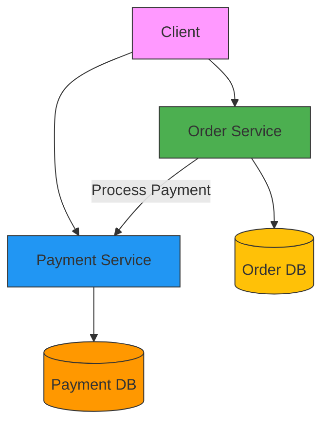

# 🛍️ Order & Payment Microservices

[](https://www.oracle.com/java/)
[](https://spring.io/projects/spring-boot)
[](https://www.docker.com/)
[](https://opensource.org/licenses/MIT)

A practical implementation of a microservices-based order and payment system demonstrating service decomposition, inter-service communication, and database per service pattern.

## 🚀 Features

- **Order Service**: Manage order lifecycle with RESTful endpoints
- **Payment Service**: Process payments asynchronously
- **Independent Databases**: Each service has its own MySQL database
- **Containerized**: Easy deployment with Docker Compose
- **API Documentation**: Interactive Swagger UI
- **Centralized Exception Handling**: Consistent error responses

## 🌟 Quick Start

1. **Prerequisites**
   - Java 17+
   - Docker & Docker Compose
   - Gradle 8.0+

2. **Run with Docker Compose**
   ```bash
   docker-compose up -d
   ```

3. **Access Services**
   - Order Service: http://localhost:8081
   - Payment Service: http://localhost:8082
   - Order API Docs: http://localhost:8081/swagger-ui.html
   - Payment API Docs: http://localhost:8082/swagger-ui.html

## 🏗️ System Architecture



## 📁 Project Structure

```
DecompositionOfService/
├── Order/                           # Order Service
│   ├── src/
│   │   ├── main/java/com/example/order/
│   │   │   ├── config/             # Configuration classes
│   │   │   │   └── OpenAPIConfig.java
│   │   │   │   └── RestConfig.java
│   │   │   ├── exception/          # Exception handling
│   │   │   │   ├── GlobalExceptionHandler.java
│   │   │   │   └── ResourceNotFoundException.java
│   │   │   ├── dto/                # Data Transfer Objects
│   │   │   │   ├── PaymentDTO.java
│   │   │   │   └── PaymentRequest.java
│   │   │   ├── model/              # Domain models
│   │   │   │   ├── Order.java
│   │   │   │   └── OrderStatus.java
│   │   │   ├── repository/         # Data access layer
│   │   │   │   └── OrderRepository.java
│   │   │   ├── service/            # Business logic
│   │   │   │   └── OrderService.java
│   │   │   ├── web/                # Controllers
│   │   │   │   └── OrderController.java
│   │   │   ├── OrderApplication.java
│   │   │   └── ...
│   │   └── resources/
│   │       └── application.properties
│   └── build.gradle
│
├── Payment/                         # Payment Service
│   ├── src/
│   │   ├── main/java/com/example/payement/
│   │   │   ├── config/             # Configuration classes
│   │   │   │   └── OpenAPIConfig.java
│   │   │   ├── model/              # Domain models
│   │   │   │   └── Payment.java
│   │   │   ├── repository/         # Data access layer
│   │   │   │   └── PaymentRepository.java
│   │   │   ├── web/                # Controllers
│   │   │   │   └── PaymentController.java
│   │   │   ├── PaymentApplication.java
│   │   │   └── ...
│   │   └── resources/
│   │       └── application.properties
│   └── build.gradle
│
├── docker-compose.yml              # Docker Compose configuration
└── README.md                       # This file
```

## 🧩 Service Decomposition

### 1. Order Service (Port: 8081)

#### 🎯 Responsibilities
- Order lifecycle management (CRUD operations)
- Order validation and status updates
- Integration with Payment Service
- Comprehensive error handling

#### 🛠️ Key Components
| Component | Description |
|-----------|-------------|
| `OrderController` | REST endpoints for order operations |
| `OrderService` | Business logic and workflow |
| `OrderRepository` | Data access and persistence |
| `GlobalExceptionHandler` | Centralized error handling |
| `RestTemplateConfig` | HTTP client configuration |

### 2. Payment Service (Port: 8082)

#### 🎯 Responsibilities
- Payment processing
- Transaction management
- Idempotent operations
- Payment status tracking

#### 🛠️ Key Components
| Component | Description |
|-----------|-------------|
| `PaymentController` | REST endpoints for payment operations |
| `PaymentService` | Payment processing logic |
| `PaymentRepository` | Data access and persistence |
| `PaymentStatus` | Payment status enumeration |
| `Transaction` | Transaction entity |


## 🔌 API Endpoints

### 📦 Order Service

| Method | Endpoint | Description |
|--------|----------|-------------|
| `POST` | `/orders` | Create a new order |
| `GET`  | `/orders/{id}` | Get order by ID |
| `GET`  | `/orders` | Get all orders (paginated) |

### 💳 Payment Service

| Method | Endpoint | Description |
|--------|----------|-------------|
| `POST` | `/payments` | Process a payment |
| `GET`  | `/payments/{id}` | Get payment by ID |
| `GET`  | `/payments/order/{orderId}` | Get payment by order ID |

## 🚦 Example Requests

### Create Order
```http
POST /orders
Content-Type: application/json

{
  "orderNumber": "ORD-12345",
  "price": 199.99,
  "productName": "Wireless Headphones"
}
```

### Process Payment
```http
POST /payments
Content-Type: application/json

{
  "orderId": 1,
  "amount": 199.99
}
```

### Order Service

#### 1. Create a New Order
- **Endpoint**: `POST /orders`
- **Request Body**:
  ```json
  {
    "orderNumber": "ORD-12345",
    "price": 99.99,
    "productName": "Laptop"
  }
  ```
- **Success Response (201 Created)**:
  ```json
  {
    "order": {
      "id": 1,
      "orderNumber": "ORD-12345",
      "price": 99.99,
      "status": "PENDING",
      "createdDate": "2025-11-09T11:30:00"
    },
    "amount": 99.99,
    "transactionStatus": "SUCCESS"
  }
  ```
- **Description**: Creates a new order and processes the payment. Returns order details with payment status.

#### 2. Get Order by ID
- **Endpoint**: `GET /orders/{id}`
- **Path Parameters**:
  - `id` - Order ID (required)
- **Success Response (200 OK)**:
  ```json
  {
    "id": 1,
    "orderNumber": "ORD-12345",
    "price": 99.99,
    "status": "COMPLETED",
    "createdDate": "2025-11-09T11:30:00"
  }
  ```
- **Description**: Retrieves order details by ID.

#### 3. Get All Orders
- **Endpoint**: `GET /orders`
- **Query Parameters**:
  - `page` - Page number (default: 0)
  - `size` - Items per page (default: 10)
- **Success Response (200 OK)**:
  ```json
  [
    {
      "id": 1,
      "orderNumber": "ORD-12345",
      "price": 99.99,
      "status": "COMPLETED",
      "createdDate": "2025-11-09T11:30:00"
    },
    {
      "id": 2,
      "orderNumber": "ORD-12346",
      "price": 149.99,
      "status": "PENDING",
      "createdDate": "2025-11-09T11:35:00"
    }
  ]
  ```
- **Description**: Retrieves a paginated list of all orders.

### Payment Service

#### 1. Process Payment
- **Endpoint**: `POST /payments`
- **Request Body**:
  ```json
  {
    "orderId": 1,
    "amount": 99.99
  }
  ```
- **Success Response (200 OK)**:
  ```json
  {
    "id": 1,
    "orderId": 1,
    "amount": 99.99,
    "status": "SUCCESS",
    "transactionId": "TXN-1234567890"
  }
  ```
- **Description**: Processes a payment for the specified order. Returns payment details with transaction status.

#### 2. Get Payment by ID
- **Endpoint**: `GET /payments/{id}`
- **Path Parameters**:
  - `id` - Payment ID (required)
- **Success Response (200 OK)**:
  ```json
  {
    "id": 1,
    "orderId": 1,
    "amount": 99.99,
    "status": "SUCCESS",
    "transactionId": "TXN-1234567890",
    "timestamp": "2025-11-09T11:30:05"
  }
  ```
- **Description**: Retrieves payment details by payment ID.

#### 3. Get Payment by Order ID
- **Endpoint**: `GET /payments/order/{orderId}`
- **Path Parameters**:
  - `orderId` - Order ID (required)
- **Success Response (200 OK)**:
  ```json
  {
    "id": 1,
    "orderId": 1,
    "amount": 99.99,
    "status": "SUCCESS",
    "transactionId": "TXN-1234567890",
    "timestamp": "2025-11-09T11:30:05"
  }
  ```
- **Description**: Retrieves payment details by order ID.

## Database Schema

### Order Service
- **orders** table
  - id (PK)
  - order_number (String)
  - price (Double)
  - status (ENUM: PENDING, PAID, SHIPPED, DELIVERED, CANCELLED, PAYMENT_FAILED, PAYMENT_PENDING, REFUNDED)
  - created_date (Timestamp)
  - updated_date (Timestamp)

### Payment Service
- **payments** table
  - id (PK)
  - order_id (Long, FK to orders.id)
  - amount (Double)
  - status (String)
  - transaction_id (String, unique)
  - created_at (Timestamp)
  - updated_at (Timestamp)

## 🛠️ Prerequisites

- Java 17 or higher
- Gradle 8.0+
- Docker and Docker Compose
- MySQL 8.0+ (or use provided Docker Compose setup)

## 🚀 Quick Start with Docker Compose

1. **Start the Databases**
   ```bash
   docker-compose up -d
   ```
   This will start two MySQL containers:
   - Order DB: `order-db` (port 3306)
   - Payment DB: `payment-db` (port 3307)

2. **Run the Services**
   - **Order Service** (port 8081)
     ```bash
     cd Order
     ./gradlew bootRun
     ```
     - API Docs: http://localhost:8081/swagger-ui.html
   
   - **Payment Service** (port 8082)
     ```bash
     cd Payment
     ./gradlew bootRun
     ```
     - API Docs: http://localhost:8082/swagger-ui.html

3. **Stop the Services**
   ```bash
   # Stop the application services (Ctrl+C in the terminals)
   # Stop and remove database containers
   docker-compose down
   ```

## 📦 Dependencies

### Common Dependencies (both services)
- Spring Boot 3.5.7
- Spring Data JPA
- Spring Web
- Lombok
- MySQL Connector
- Spring Boot Validation
- Spring Boot Actuator (for monitoring)
- Spring Doc OpenAPI (for API documentation)

### Order Service Additional Dependencies
- Spring Cloud OpenFeign (for service communication)
- Resilience4j (for circuit breaking)
- Spring Retry (for retry mechanisms)

## 📚 API Documentation

Both services include interactive API documentation using Swagger UI:

### Order Service API (http://localhost:8081/swagger-ui.html)
- **POST** `/api/orders` - Create a new order
- **GET** `/api/orders/{id}` - Get order by ID
- **GET** `/api/orders` - Get all orders

### Payment Service API (http://localhost:8082/swagger-ui.html)
- **POST** `/api/payments` - Process a payment
- **GET** `/api/payments/order/{orderId}` - Get payment by order ID
- **GET** `/api/payments/{id}` - Get payment by ID

### Error Responses

All APIs return consistent error responses in the following format:

```json
{
  "timestamp": "2025-11-09T12:30:45.123+05:30",
  "status": 404,
  "error": "Not Found",
  "message": "Order not found with id: 999",
  "path": "/api/orders/999"
}
```

## 🧪 Testing

Run tests for both services using:
```bash
# In each service directory
./gradlew test
```

## 📊 Monitoring

Both services include Spring Boot Actuator endpoints for monitoring:
- Health: `GET /actuator/health`
- Info: `GET /actuator/info`
- Metrics: `GET /actuator/metrics`


The application implements a centralized exception handling mechanism using Spring's `@ControllerAdvice`. The following exceptions are handled:

- `ResourceNotFoundException`: Returns 404 Not Found
- `IllegalArgumentException`: Returns 400 Bad Request
- `ConstraintViolationException`: Returns 400 Bad Request with validation errors
- `MethodArgumentNotValidException`: Returns 400 Bad Request with field validation errors
- Generic exceptions return 500 Internal Server Error

### Custom Exceptions

- `ResourceNotFoundException`: Thrown when a requested resource is not found

### Error Response Format

All error responses follow this structure:

```json
{
  "timestamp": "2025-11-09T12:30:45.123+05:30",
  "status": 400,
  "error": "Bad Request",
  "message": "Validation failed: price: must be greater than 0",
  "path": "/api/orders"
}
```

## 💾 Database Configuration

The application uses two separate MySQL databases managed by Docker Compose:

### Order Service Database
- **Host**: localhost
- **Port**: 3306
- **Database**: order_db
- **Username**: order_user
- **Password**: orderpass

### Payment Service Database
- **Host**: localhost
- **Port**: 3307
- **Database**: payment_db
- **Username**: payment_user
- **Password**: paymentpass

### Schema Management
- Database schema is automatically created/updated by Hibernate (spring.jpa.hibernate.ddl-auto=update)
- Tables are created based on JPA entities
- Sample data can be loaded using `data.sql` in the respective service's resources directory

## ✨ Key Features


## Database Schema

### Order Service
- `orders` table
  - id (PK)
  - orderNumber
  - price
  - status
  - createdDate

### Payment Service
- `payment` table
  - id (PK)
  - orderId
  - amount
  - status
  - transactionId
  - timestamp

## Future Enhancements

1. Add service discovery with Eureka
2. Implement API Gateway for routing
3. Add distributed tracing with Spring Cloud Sleuth
4. Implement circuit breakers with Resilience4j
5. Add API documentation with SpringDoc OpenAPI
