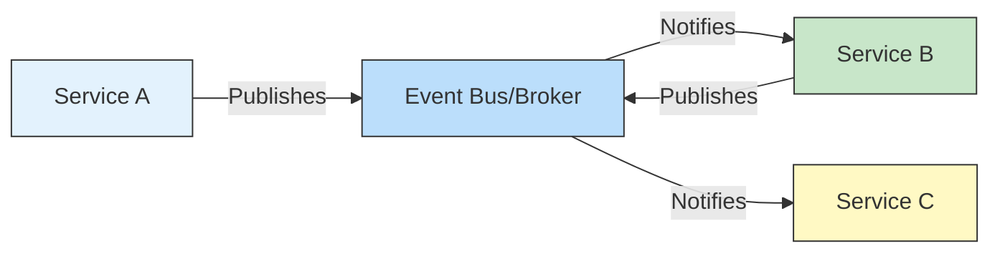
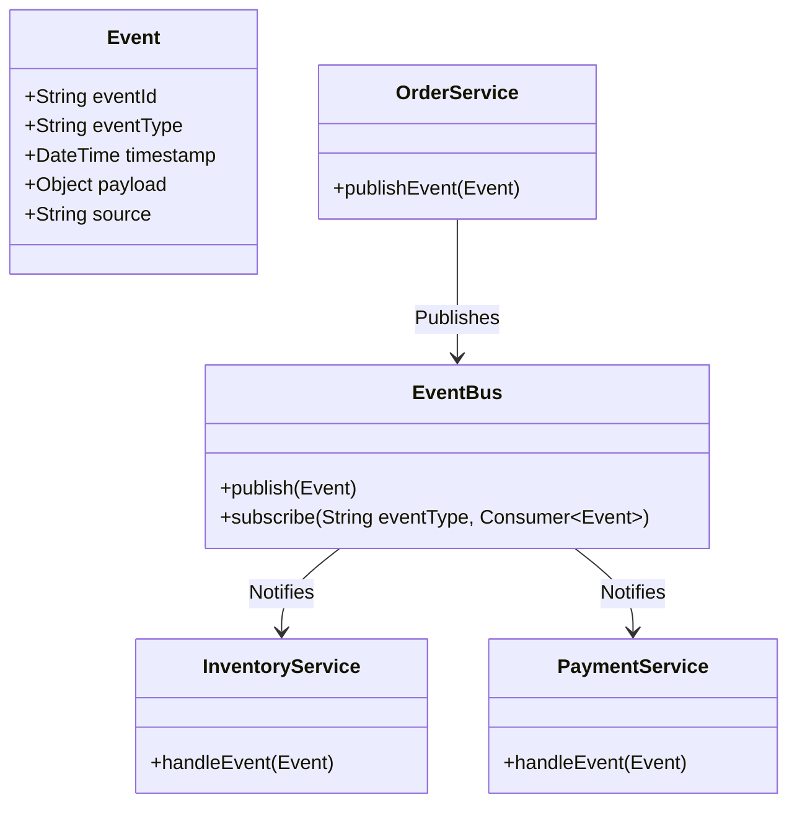
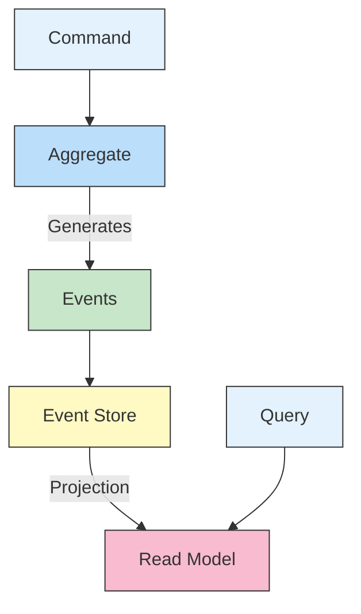

# ⚡ Event-Driven Architecture in Microservices

## 📌 Overview
Event-Driven Architecture (EDA) is a design paradigm where services communicate through the production and consumption of events. This approach enables loose coupling, scalability, and real-time processing in distributed systems.



## 🎯 Why Use Event-Driven Architecture?

| Challenge | EDA Solution | Benefit |
|-----------|--------------|---------|
| Tight Coupling | Loose coupling via events | Independent service evolution |
| Performance | Asynchronous processing | Better resource utilization |
| Real-time needs | Event streaming | Immediate reaction to changes |
| Scalability | Event-driven scaling | Handle variable loads efficiently |
| Data consistency | Event sourcing | Reliable state management |

## 🏗️ Core Concepts

### 1. Events
- Immutable records of something that happened
- Example: `OrderPlaced`, `PaymentProcessed`, `InventoryUpdated`

### 2. Event Producers
- Services that publish events
- Don't know about consumers
- Example: Order Service publishes `OrderCreated` event

### 3. Event Consumers
- Services that subscribe to events
- React to events asynchronously
- Example: Inventory Service consumes `OrderCreated` to update stock

### 4. Event Broker/Message Bus
- Middleware that routes events
- Examples: Apache Kafka, RabbitMQ, AWS EventBridge



## 🛠️ Implementation with Spring Cloud Stream

### 1. Dependencies (`build.gradle`)
```gradle
dependencies {
    implementation 'org.springframework.cloud:spring-cloud-stream'
    implementation 'org.springframework.cloud:spring-cloud-starter-stream-kafka'
    implementation 'org.springframework.cloud:spring-cloud-stream-binder-kafka-streams'
    implementation 'org.springframework.kafka:spring-kafka'
}
```

### 2. Application Properties (`application.yml`)
```yaml
spring:
  cloud:
    stream:
      kafka:
        binder:
          brokers: localhost:9092
      bindings:
        orderCreated-out-0:
          destination: orders
          content-type: application/json
        inventory-in-0:
          destination: orders
          group: inventory-service
          content-type: application/json
      kafka:
        streams:
          binder:
            configuration:
              commit.interval.ms: 100
              num.stream.threads: 4
```

### 3. Event Model
```java
public class OrderEvent {
    private String eventId;
    private String eventType;
    private LocalDateTime timestamp;
    private String orderId;
    private String customerId;
    private BigDecimal amount;
    private Map<String, Object> payload;
    
    // Constructors, getters, setters
}
```

### 4. Event Producer
```java
import org.springframework.messaging.Message;
import org.springframework.messaging.support.MessageBuilder;
import org.springframework.cloud.stream.function.StreamBridge;

@Service
@RequiredArgsConstructor
public class OrderService {
    
    private final StreamBridge streamBridge;
    
    public void placeOrder(Order order) {
        // Process order
        OrderEvent event = OrderEvent.builder()
            .eventId(UUID.randomUUID().toString())
            .eventType("OrderPlaced")
            .timestamp(LocalDateTime.now())
            .orderId(order.getId())
            .customerId(order.getCustomerId())
            .amount(order.getTotalAmount())
            .payload(Map.of("items", order.getItems()))
            .build();
            
        // Publish event
        Message<OrderEvent> message = MessageBuilder
            .withPayload(event)
            .setHeader("event-type", event.getEventType())
            .build();
            
        streamBridge.send("orderCreated-out-0", message);
    }
}
```

### 5. Event Consumer
```java
import org.springframework.context.annotation.Bean;
import org.springframework.messaging.Message;
import java.util.function.Consumer;

@Configuration
public class EventHandlers {
    
    @Bean
    public Consumer<Message<OrderEvent>> inventory() {
        return message -> {
            OrderEvent event = message.getPayload();
            String eventType = (String) message.getHeaders().get("event-type");
            
            if ("OrderPlaced".equals(eventType)) {
                // Update inventory
                System.out.println("Updating inventory for order: " + event.getOrderId());
                // Business logic here
            }
        };
    }
    
    @Bean
    public Consumer<Message<OrderEvent>> payment() {
        return message -> {
            OrderEvent event = message.getPayload();
            String eventType = (String) message.getHeaders().get("event-type");
            
            if ("OrderPlaced".equals(eventType)) {
                // Process payment
                System.out.println("Processing payment for order: " + event.getOrderId());
                // Business logic here
            }
        };
    }
}
```

## 🔄 Event Sourcing Pattern

### 1. Event Store
```java
public interface EventStore {
    void save(String aggregateId, List<DomainEvent> events, long expectedVersion);
    List<DomainEvent> getEvents(String aggregateId);
    List<String> getAggregateIds();
}

@Service
public class EventSourcingOrderService {
    private final EventStore eventStore;
    
    public void process(PlaceOrderCommand command) {
        String orderId = command.getOrderId();
        List<DomainEvent> events = new ArrayList<>();
        
        // 1. Create OrderPlaced event
        events.add(new OrderPlaced(
            UUID.randomUUID().toString(),
            orderId,
            command.getCustomerId(),
            command.getItems(),
            LocalDateTime.now()
        ));
        
        // 2. Save events to event store
        eventStore.save(orderId, events, -1);
        
        // 3. Publish events
        events.forEach(this::publish);
    }
    
    private void publish(DomainEvent event) {
        // Publish to event bus
    }
}
```

### 2. Event Sourcing with Axon Framework
```java
@Aggregate
public class OrderAggregate {
    @AggregateIdentifier
    private String orderId;
    private OrderStatus status;
    
    @CommandHandler
    public OrderAggregate(PlaceOrderCommand command) {
        apply(new OrderPlacedEvent(
            command.getOrderId(),
            command.getCustomerId(),
            command.getItems()
        ));
    }
    
    @EventSourcingHandler
    public void on(OrderPlacedEvent event) {
        this.orderId = event.getOrderId();
        this.status = OrderStatus.CREATED;
    }
    
    @CommandHandler
    public void handle(CancelOrderCommand command) {
        apply(new OrderCancelledEvent(
            command.getOrderId(),
            command.getReason()
        ));
    }
    
    @EventSourcingHandler
    public void on(OrderCancelledEvent event) {
        this.status = OrderStatus.CANCELLED;
    }
}
```

## 🏆 Best Practices

### 1. Event Design
- Use past tense for event names (e.g., `OrderPlaced`)
- Make events immutable
- Include correlation IDs for tracing
- Version your event schema

### 2. Error Handling
- Implement dead-letter queues
- Use retry with exponential backoff
- Implement circuit breakers
- Log failed events for manual intervention

### 3. Performance
- Batch event processing when possible
- Use efficient serialization (e.g., Protocol Buffers, Avro)
- Monitor consumer lag
- Scale consumers horizontally

### 4. Testing
- Test event producers and consumers in isolation
- Verify event schemas
- Test event ordering guarantees
- Simulate network partitions and failures

## 🌟 Event Processing Patterns

### 1. Event Notification
- Simple notification of state changes
- Consumers fetch additional data if needed
- Low coupling, but requires additional lookups

### 2. Event-Carried State Transfer
- Events contain all necessary data
- Consumers don't need to query back to source
- Higher event payload, but better decoupling

### 3. CQRS (Command Query Responsibility Segregation)
- Separate read and write models
- Event-sourced write model
- Materialized views for reads
- Eventual consistency



## 🚀 Example: E-Commerce Order Processing

### Event Flow
1. `OrderPlaced` → Inventory Service (reserve items)
2. `PaymentProcessed` → Order Service (confirm order)
3. `OrderConfirmed` → Notification Service (send email)
4. `InventoryUpdated` → Analytics Service (update dashboard)

### Implementation with Kafka Streams
```java
@Configuration
public class OrderProcessingTopology {
    
    @Bean
    public KStream<String, OrderEvent> orderProcessingStream(
        StreamsBuilder builder) {
        
        KStream<String, OrderEvent> stream = builder
            .stream("orders", Consumed.with(Serdes.String(), new JsonSerde<>(OrderEvent.class)));
            
        // Process orders
        stream.filter((key, order) -> "OrderPlaced".equals(order.getEventType()))
              .mapValues(this::validateOrder)
              .to("validated-orders");
              
        // Handle payments
        KStream<String, PaymentEvent> payments = stream
            .filter((key, order) -> "OrderValidated".equals(order.getEventType()))
            .mapValues(this::processPayment);
            
        // Branch based on payment status
        payments.split()
            .branch((k, v) -> "PAYMENT_APPROVED".equals(v.getStatus()), 
                   Branched.withConsumer(ks -> ks.to("payments-approved")))
            .branch((k, v) -> "PAYMENT_DECLINED".equals(v.getStatus()),
                   Branched.withConsumer(ks -> ks.to("payments-declined")));
            
        return stream;
    }
    
    private OrderEvent validateOrder(OrderEvent order) {
        // Validation logic
        return order;
    }
    
    private PaymentEvent processPayment(OrderEvent order) {
        // Payment processing logic
        return new PaymentEvent(
            UUID.randomUUID().toString(),
            order.getOrderId(),
            "PAYMENT_PROCESSED",
            LocalDateTime.now(),
            order.getAmount()
        );
    }
}
```

## 📚 Resources
- [Event-Driven Architecture Patterns](https://martinfowler.com/eaaDev/EventSourcing.html)
- [Spring Cloud Stream Documentation](https://spring.io/projects/spring-cloud-stream)
- [Kafka Streams Documentation](https://kafka.apache.org/documentation/streams/)
- [Axon Framework](https://axoniq.io/)
- [Event Sourcing Pattern](https://microservices.io/patterns/data/event-sourcing.html)

## 🔗 Related Topics
- [Service Mesh](./SERVICE_MESH.md)
- [CQRS Pattern](./CQRS_PATTERN.md)
- [Saga Pattern](./SAGA_PATTERN.md)

---

[← Back to Main Learning Path](../README.md) | [Next: CQRS Pattern →]()
