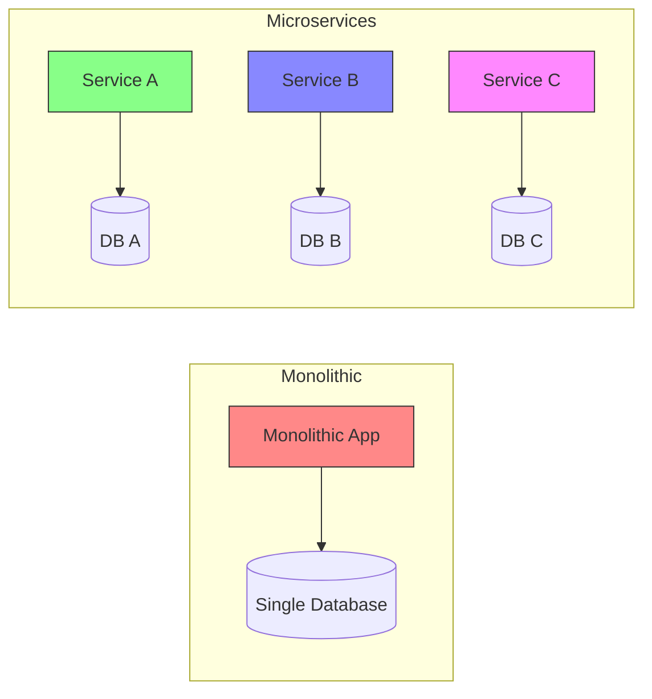

# Microservices Fundamentals

## 1. What are Microservices?

Microservices is an architectural style that structures an application as a collection of small, independent services that communicate over well-defined APIs. Each service is:

- **Loosely coupled** - Services can be developed, deployed, and scaled independently
- **Independently deployable** - Each service runs in its own process
- **Organized around business capabilities** - Services align with business domains
- **Own their data** - Each service manages its own database

## 2. Monolithic vs Microservices Architecture

### Monolithic Architecture
- Single codebase
- Single database
- Tightly coupled components
- Single deployment unit
- Scales as a whole

### Microservices Architecture
- Multiple independent services
- Multiple databases (one per service)
- Loosely coupled services
- Independent deployment
- Granular scaling

## 3. Benefits and Challenges

### Benefits

| Benefit | Description |
|---------|-------------|
| **Independent Deployment** | Deploy services independently without affecting others |
| **Technology Diversity** | Use different technologies for different services |
| **Fault Isolation** | Failure in one service doesn't affect others |
| **Scalability** | Scale only the services that need it |
| **Faster Development** | Teams can work on different services simultaneously |

### Challenges

| Challenge | Description |
|-----------|-------------|
| **Complexity** | More moving parts to manage |
| **Data Consistency** | Maintaining consistency across services |
| **Testing** | More complex testing scenarios |
| **Monitoring** | Need for distributed tracing |
| **Network Latency** | Service-to-service communication overhead |

## 4. When to Use Microservices

### Good Candidates for Microservices
- Large, complex applications
- Applications with independent business domains
- Teams that need to scale development
- Applications requiring different scaling needs
- Need for technology flexibility

### When to Think Twice
- Small applications with simple requirements
- Tightly coupled domains
- Limited DevOps expertise
- Budget constraints (higher operational overhead)
- Strict consistency requirements

## 5. Key Considerations

## 6. Next Steps

1. [Explore Service Decomposition](./DECOMPOSITION.md)
2. [Start with a Practical Example](./DecompositionOfService/README.md)
3. Learn about [API Gateway Pattern]()
4. Understand [Service Discovery]()

---

[← Back to Main Learning Path](../README.md) | [Next: Service Decomposition →](./DECOMPOSITION.md)
