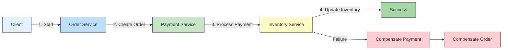
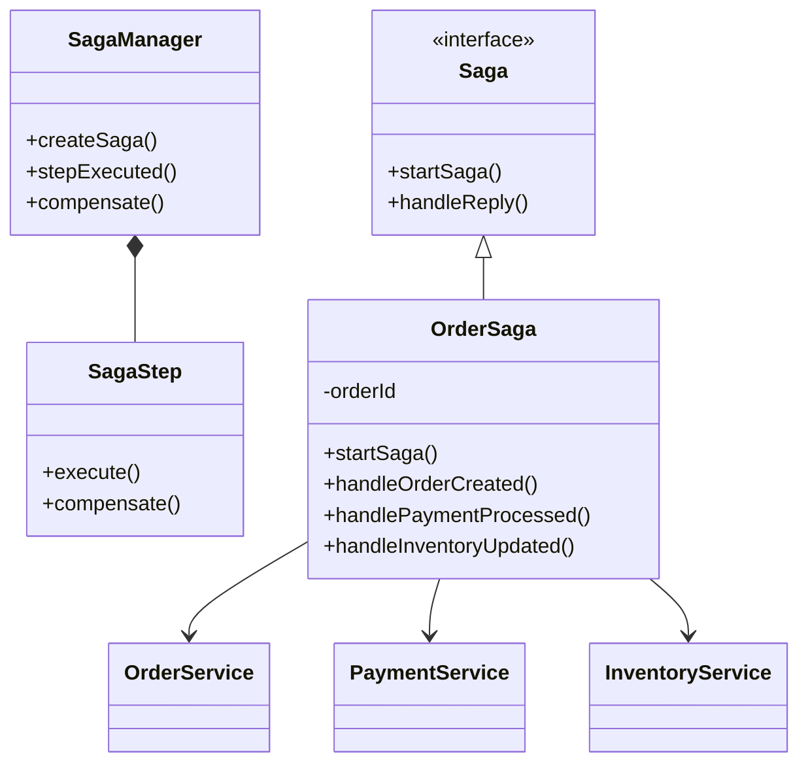

# 🔄 Saga Pattern in Microservices

## 📌 Overview
The Saga pattern is a design pattern that manages distributed transactions across multiple microservices by breaking them into a series of local transactions, each with its own compensating transaction for rollback purposes.



## 🎯 Why Use the Saga Pattern?

| Challenge | Saga Solution | Benefit |
|-----------|--------------|---------|
| Distributed transactions | Local transactions with compensation | No distributed locks |
| Long-running transactions | Asynchronous execution | Better performance |
| Data consistency | Eventual consistency | Higher availability |
| Service autonomy | Local ACID transactions | Loose coupling |
| Failure handling | Compensating transactions | Reliable rollback |

## 🏗️ Saga Architecture

### 1. Choreography-Based Saga
- Services communicate through events
- Decentralized coordination
- Each service knows what to do next

### 2. Orchestration-Based Saga
- Centralized orchestrator manages the flow
- Single point of coordination
- Easier to understand and maintain



## 🛠️ Implementation with Axon Framework

### 1. Dependencies (`build.gradle`)
```gradle
dependencies {
    implementation 'org.axonframework:axon-spring-boot-starter:4.5.13'
    implementation 'org.springframework.boot:spring-boot-starter-data-jpa'
    implementation 'com.h2database:h2'
    implementation 'org.projectlombok:lombok'
    annotationProcessor 'org.projectlombok:lombok'
}
```

### 2. Saga Class (Orchestrator)
```java
@Saga
@Slf4j
@RequiredArgsConstructor
public class OrderSaga {
    
    @Autowired
    private transient CommandGateway commandGateway;
    
    private String orderId;
    private String paymentId;
    private OrderStatus status;
    
    @StartSaga
    @SagaEventHandler(associationProperty = "orderId")
    public void handle(OrderCreatedEvent event) {
        this.orderId = event.getOrderId();
        this.status = OrderStatus.CREATED;
        
        ProcessPaymentCommand command = new ProcessPaymentCommand(
            UUID.randomUUID().toString(),
            event.getOrderId(),
            event.getCustomerId(),
            event.getAmount()
        );
        
        commandGateway.send(command, (commandMessage, commandResultMessage) -> {
            if (commandResultMessage.isExceptional()) {
                // Handle payment failure
                commandGateway.send(new RejectOrderCommand(
                    event.getOrderId(),
                    "Payment failed: " + commandResultMessage.exceptionResult().getMessage()
                ));
            }
        });
    }
    
    @SagaEventHandler(associationProperty = "orderId")
    public void handle(PaymentProcessedEvent event) {
        this.paymentId = event.getPaymentId();
        this.status = OrderStatus.PAYMENT_APPROVED;
        
        UpdateInventoryCommand command = new UpdateInventoryCommand(
            UUID.randomUUID().toString(),
            event.getOrderId(),
            event.getItems()
        );
        
        commandGateway.send(command);
    }
    
    @SagaEventHandler(associationProperty = "orderId")
    public void handle(InventoryUpdatedEvent event) {
        this.status = OrderStatus.COMPLETED;
        commandGateway.send(new ApproveOrderCommand(event.getOrderId()));
        SagaLifecycle.end();
    }
    
    @SagaEventHandler(associationProperty = "orderId")
    public void handle(PaymentFailedEvent event) {
        log.error("Payment failed for order {}", event.getOrderId());
        this.status = OrderStatus.REJECTED;
        commandGateway.send(new RejectOrderCommand(
            event.getOrderId(),
            "Payment failed: " + event.getReason()
        ));
        SagaLifecycle.end();
    }
    
    @EndSaga
    @SagaEventHandler(associationProperty = "orderId")
    public void handle(OrderRejectedEvent event) {
        log.info("Order {} was rejected: {}", event.getOrderId(), event.getReason());
        // Compensating transactions would be triggered here
        if (this.paymentId != null) {
            commandGateway.send(new RefundPaymentCommand(
                UUID.randomUUID().toString(),
                this.paymentId,
                event.getOrderId(),
                "Order rejected: " + event.getReason()
            ));
        }
        this.status = OrderStatus.REJECTED;
    }
}
```

### 3. Event Handlers
```java
@Component
@RequiredArgsConstructor
public class OrderEventHandlers {
    
    private final EventScheduler eventScheduler;
    
    @EventHandler
    public void on(OrderCreatedEvent event) {
        // Schedule a timeout for the order
        eventScheduler.schedule(
            Duration.ofMinutes(30),
            new OrderTimeoutEvent(event.getOrderId())
        );
    }
    
    @EventHandler
    public void on(OrderTimeoutEvent event) {
        // Handle order timeout (e.g., cancel order if not completed)
    }
}
```

## 🔄 Choreography-Based Saga Example

### 1. Order Service
```java
@Service
@RequiredArgsConstructor
public class OrderService {
    
    private final ApplicationEventPublisher eventPublisher;
    private final OrderRepository orderRepository;
    
    @Transactional
    public String createOrder(CreateOrderRequest request) {
        // Create order
        Order order = new Order(
            UUID.randomUUID().toString(),
            request.getCustomerId(),
            request.getItems(),
            OrderStatus.CREATED
        );
        
        order = orderRepository.save(order);
        
        // Publish event
        eventPublisher.publishEvent(new OrderCreatedEvent(
            order.getId(),
            order.getCustomerId(),
            order.getItems(),
            order.calculateTotal()
        ));
        
        return order.getId();
    }
    
    @Transactional
    public void handle(PaymentProcessedEvent event) {
        orderRepository.findById(event.getOrderId()).ifPresent(order -> {
            order.setStatus(OrderStatus.PAYMENT_APPROVED);
            orderRepository.save(order);
            
            // Publish event for next step
            eventPublisher.publishEvent(new PaymentApprovedEvent(
                event.getOrderId(),
                event.getPaymentId(),
                order.getItems()
            ));
        });
    }
    
    @Transactional
    public void handle(PaymentFailedEvent event) {
        orderRepository.findById(event.getOrderId()).ifPresent(order -> {
            order.setStatus(OrderStatus.REJECTED);
            order.setRejectionReason(event.getReason());
            orderRepository.save(order);
        });
    }
}
```

## 🏆 Best Practices

### 1. Idempotency
- Make all operations idempotent
- Use unique IDs for all commands/events
- Implement idempotency keys

### 2. Compensation Logic
- Design compensating transactions carefully
- Handle partial failures
- Implement retry mechanisms
- Log all compensation actions

### 3. Monitoring and Tracing
- Implement distributed tracing
- Log all saga steps
- Set up alerts for failed sagas
- Monitor saga timeouts

### 4. Testing
- Test happy path
- Test failure scenarios
- Test compensation logic
- Test idempotency
- Test concurrent executions

## 🌟 Saga vs. Other Patterns

| Aspect | Saga | 2PC | Event Sourcing |
|--------|------|-----|----------------|
| Consistency | Eventual | Strong | Eventual |
| Performance | High | Low | Medium |
| Complexity | Medium | Low | High |
| Failure Handling | Compensating | Rollback | Replay events |
| Use Case | Long-running | Short-lived | Audit trail |

## 🚀 Example: E-Commerce Order Processing

### 1. Order Service
```java
@RestController
@RequestMapping("/api/orders")
@RequiredArgsConstructor
public class OrderController {
    
    private final CommandGateway commandGateway;
    
    @PostMapping
    public CompletableFuture<String> createOrder(@RequestBody CreateOrderRequest request) {
        String orderId = UUID.randomUUID().toString();
        return commandGateway.send(new CreateOrderCommand(
            orderId,
            request.getCustomerId(),
            request.getItems()
        )).thenApply(v -> orderId);
    }
    
    @GetMapping("/{orderId}")
    public OrderStatus getOrderStatus(@PathVariable String orderId) {
        return commandGateway.send(new GetOrderStatusQuery(orderId));
    }
}
```

### 2. Payment Service
```java
@Slf4j
@RequiredArgsConstructor
public class PaymentService {
    
    private final PaymentRepository paymentRepository;
    private final ApplicationEventPublisher eventPublisher;
    
    @Transactional
    public void processPayment(ProcessPaymentCommand command) {
        try {
            // Process payment
            Payment payment = new Payment(
                command.getPaymentId(),
                command.getOrderId(),
                command.getAmount(),
                PaymentStatus.PROCESSING
            );
            
            payment = paymentRepository.save(payment);
            
            // Simulate payment processing
            if (Math.random() > 0.1) { // 90% success rate
                payment.approve();
                eventPublisher.publishEvent(new PaymentProcessedEvent(
                    payment.getId(),
                    payment.getOrderId(),
                    payment.getAmount()
                ));
            } else {
                payment.reject("Insufficient funds");
                eventPublisher.publishEvent(new PaymentFailedEvent(
                    payment.getOrderId(),
                    "Insufficient funds"
                ));
            }
            
            paymentRepository.save(payment);
            
        } catch (Exception e) {
            log.error("Error processing payment for order {}", command.getOrderId(), e);
            eventPublisher.publishEvent(new PaymentFailedEvent(
                command.getOrderId(),
                "Payment processing error: " + e.getMessage()
            ));
            throw e;
        }
    }
    
    @Transactional
    public void processRefund(RefundPaymentCommand command) {
        paymentRepository.findById(command.getPaymentId()).ifPresent(payment -> {
            payment.refund(command.getReason());
            paymentRepository.save(payment);
            
            eventPublisher.publishEvent(new PaymentRefundedEvent(
                payment.getId(),
                payment.getOrderId(),
                payment.getAmount(),
                command.getReason()
            ));
        });
    }
}
```

## 📚 Resources
- [Saga Pattern - Microsoft Docs](https://docs.microsoft.com/en-us/azure/architecture/reference-architectures/saga/saga)
- [Implementing Business Transactions Using Sagas](https://www.cs.cornell.edu/andru/cs711/2002fa/reading/sagas.pdf)
- [Axon Framework - Sagas](https://docs.axoniq.io/reference-guide/axon-framework/sagas/)
- [Saga Pattern in Microservices](https://microservices.io/patterns/data/saga.html)

## 🔗 Related Topics
- [Event-Driven Architecture](./EVENT_DRIVEN_ARCHITECTURE.md)
- [CQRS Pattern](./CQRS_PATTERN.md)
- [Circuit Breaker Pattern](./CIRCUIT_BREAKER.md)

---

[← Back to Main Learning Path](../README.md) | [Next: API Gateway →]()
