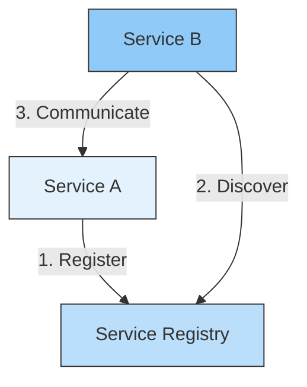
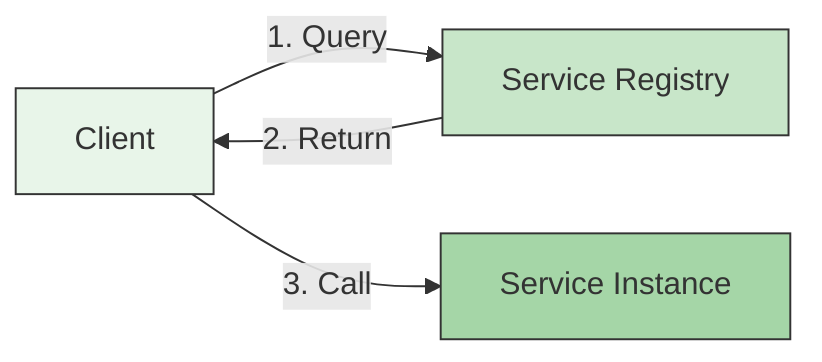
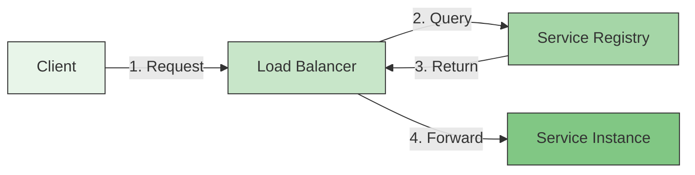
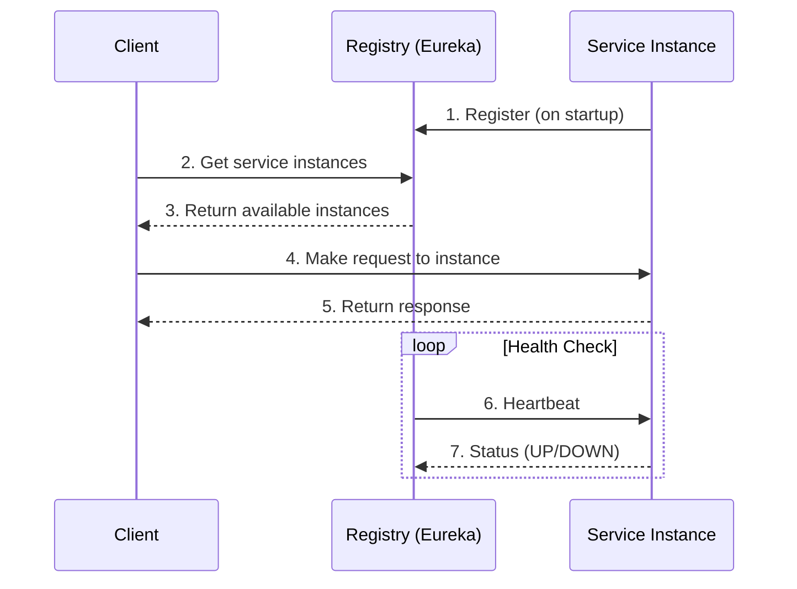

# 🔍 Service Discovery in Microservices

## 📌 Overview
Service Discovery is a key component in microservices architecture that enables services to find and communicate with each other dynamically. It helps manage the dynamic nature of microservices deployments where instances can be created, destroyed, or moved automatically.



## 🎯 Why Service Discovery?

| Challenge | Solution | Benefit |
|-----------|----------|---------|
| Dynamic IPs | Service Registry | No hardcoded URLs |
| Load Balancing | Client/Server-side discovery | Even traffic distribution |
| High Availability | Health Checks | Automatic failover |
| Service Scaling | Dynamic Registration | Automatic discovery of new instances |

## 🏗️ Service Discovery Patterns

### 1. Client-Side Discovery

- Client queries service registry
- Client uses load balancing to select an instance
- Examples: Netflix Eureka, Consul

### 2. Server-Side Discovery

- Client makes request to a load balancer
- Load balancer queries service registry
- Examples: AWS ELB, Kubernetes Service

## 🛠️ Implementation with Spring Cloud Netflix Eureka

### 1. Eureka Server Setup

#### Dependencies (`build.gradle`)
```gradle
dependencies {
    implementation 'org.springframework.cloud:spring-cloud-starter-netflix-eureka-server'
    implementation 'org.springframework.boot:spring-boot-starter-security'
}
```

#### Application Class
```java
@SpringBootApplication
@EnableEurekaServer
public class DiscoveryServiceApplication {
    public static void main(String[] args) {
        SpringApplication.run(DiscoveryServiceApplication.class, args);
    }
}
```

#### Configuration (`application.yml`)
```yaml
server:
  port: 8761

eureka:
  instance:
    hostname: localhost
  client:
    registerWithEureka: false
    fetchRegistry: false
    serviceUrl:
      defaultZone: http://${eureka.instance.hostname}:${server.port}/eureka/
  server:
    enable-self-preservation: false
```

### 2. Client Service Setup

#### Dependencies (`build.gradle`)
```gradle
dependencies {
    implementation 'org.springframework.cloud:spring-cloud-starter-netflix-eureka-client'
}
```

#### Client Configuration (`application.yml`)
```yaml
spring:
  application:
    name: order-service

eureka:
  client:
    serviceUrl:
      defaultZone: http://localhost:8761/eureka/
  instance:
    preferIpAddress: true
    instance-id: ${spring.application.name}:${spring.application.instance_id:${random.value}}
```

## 🔄 Service Registration and Discovery Flow



## 🌐 Service Discovery Solutions

| Solution | Type | Features | Best For |
|----------|------|----------|-----------|
| **Eureka** | Client-Side | Self-preservation, Zone awareness | Spring Cloud, Netflix OSS |
| **Consul** | Both | Service mesh, KV store, Health checks | Multi-datacenter, Service mesh |
| **ZooKeeper** | Both | CP system, Strong consistency | High consistency needs |
| **etcd** | Both | Distributed key-value store | Kubernetes, Cloud-native |
| **Kubernetes** | Server-Side | Built-in service discovery | Container orchestration |

## 🛡️ Security Considerations

1. **Secure Communication**
   - Enable HTTPS for service registry communication
   - Use mutual TLS (mTLS) for service-to-service communication
   
2. **Authentication**
   - Secure the service registry with basic auth or OAuth2
   - Implement service-to-service authentication
   
3. **Authorization**
   - Control which services can register/discover
   - Implement fine-grained access control

## 📊 Health Checks and Monitoring

### Health Check Endpoint
```yaml
management:
  endpoints:
    web:
      exposure:
        include: health,info,metrics
  endpoint:
    health:
      show-details: always
```

### Custom Health Indicator
```java
@Component
public class CustomHealthIndicator implements HealthIndicator {
    @Override
    public Health health() {
        // Add custom health checks
        return Health.up()
            .withDetail("custom", "Service is healthy")
            .build();
    }
}
```

## 🚀 Deployment Strategies

### 1. Standalone Eureka Server
```yaml
# docker-compose.yml
version: '3.8'
services:
  discovery-service:
    image: myapp/discovery-service:latest
    ports:
      - "8761:8761"
    environment:
      - SPRING_PROFILES_ACTIVE=production
```

### 2. High Availability Setup
```yaml
# eureka-server-1.yml
eureka:
  client:
    serviceUrl:
      defaultZone: http://eureka2:8762/eureka/

# eureka-server-2.yml
eureka:
  client:
    serviceUrl:
      defaultZone: http://eureka1:8761/eureka/
```

## 🏆 Best Practices

1. **Service Naming**
   - Use consistent naming conventions
   - Include environment prefixes (e.g., `dev-`, `prod-`)

2. **Health Checks**
   - Implement comprehensive health endpoints
   - Set appropriate check intervals

3. **Resilience**
   - Implement retry mechanisms
   - Use circuit breakers for service calls
   - Cache service lookups when appropriate

4. **Monitoring**
   - Monitor service registry health
   - Track service instance counts
   - Set up alerts for critical services

## 📚 Resources
- [Spring Cloud Netflix Eureka](https://spring.io/projects/spring-cloud-netflix)
- [Consul Service Discovery](https://www.consul.io/)
- [Service Discovery Pattern](https://microservices.io/patterns/service-registry.html)
- [Kubernetes Service Discovery](https://kubernetes.io/docs/concepts/services-networking/service/)

## 🔗 Related Projects
- [Order & Payment System](../DecompositionOfService) - Example implementation
- [Spring Cloud Netflix](https://spring.io/projects/spring-cloud-netflix) - Production-ready service discovery

---

[← Back to Main Learning Path](../README.md) | [Next: API Gateway →](./API_GATEWAY.md)
