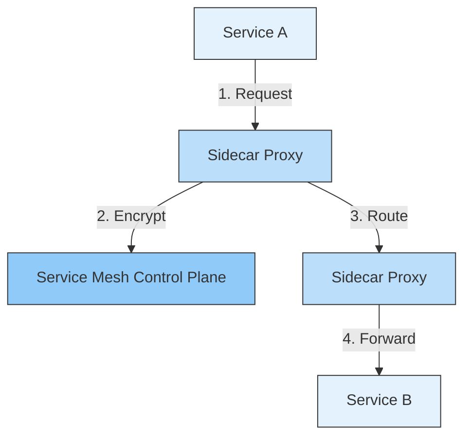
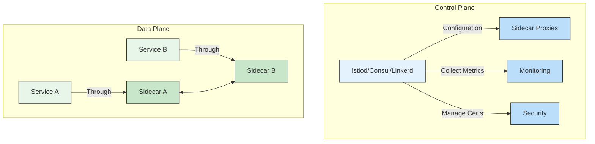

# 🌐 Service Mesh in Microservices

## 📌 Overview
A Service Mesh is a dedicated infrastructure layer that handles service-to-service communication in a microservices architecture. It provides features like service discovery, load balancing, encryption, and observability without requiring changes to application code.



## 🎯 Why Use a Service Mesh?

| Challenge | Service Mesh Solution | Benefit |
|-----------|----------------------|---------|
| Complex service communication | Sidecar proxies | Decoupled communication logic |
| Security concerns | mTLS encryption | Secure by default |
| Observability | Built-in metrics, logs, traces | Better monitoring |
| Traffic management | Fine-grained routing | Canary deployments, A/B testing |
| Resilience | Circuit breaking, retries | Improved reliability |

## 🏗️ Service Mesh Architecture

### 1. Data Plane
- Sidecar proxies (e.g., Envoy, Linkerd-proxy)
- Handles actual network communication
- Implements service discovery, load balancing, TLS termination

### 2. Control Plane
- Manages and configures proxies
- Implements policies
- Collects metrics
- Handles certificate management



## 🛠️ Implementing Service Mesh with Istio

### 1. Prerequisites
- Kubernetes Cluster (Minikube, EKS, GKE, AKS)
- `kubectl` and `istioctl` installed
- Sufficient resources (4+ vCPUs, 8GB+ RAM)

### 2. Installation
```bash
# Download Istio
curl -L https://istio.io/downloadIstio | sh -
cd istio-*
export PATH=$PWD/bin:$PATH

# Install with demo profile
istioctl install --set profile=demo -y

# Enable automatic sidecar injection
kubectl label namespace default istio-injection=enabled
```

### 3. Deploy Sample Application
```yaml
# bookinfo.yaml
apiVersion: v1
kind: Service
metadata:
  name: productpage
  labels:
    app: productpage
    service: productpage
spec:
  ports:
  - port: 9080
    name: http
  selector:
    app: productpage
---
apiVersion: apps/v1
kind: Deployment
metadata:
  name: productpage-v1
  labels:
    app: productpage
    version: v1
spec:
  replicas: 1
  selector:
    matchLabels:
      app: productpage
      version: v1
  template:
    metadata:
      labels:
        app: productpage
        version: v1
    spec:
      containers:
      - name: productpage
        image: docker.io/istio/examples-bookinfo-productpage-v1:1.16.2
        ports:
        - containerPort: 9080
```

### 4. Traffic Management
#### Virtual Service
```yaml
apiVersion: networking.istio.io/v1alpha3
kind: VirtualService
metadata:
  name: productpage
spec:
  hosts:
  - "*"
  gateways:
  - bookinfo-gateway
  http:
  - match:
    - uri:
        exact: /productpage
    route:
    - destination:
        host: productpage
        port:
          number: 9080
```

#### Destination Rule
```yaml
apiVersion: networking.istio.io/v1alpha3
kind: DestinationRule
metadata:
  name: productpage-destination
spec:
  host: productpage
  trafficPolicy:
    tls:
      mode: ISTIO_MUTUAL
```

## 🔐 Security Features

### 1. mTLS Encryption
```yaml
# peer-authentication.yaml
apiVersion: security.istio.io/v1beta1
kind: PeerAuthentication
metadata:
  name: default
  namespace: istio-system
spec:
  mtls:
    mode: STRICT
```

### 2. Authorization Policies
```yaml
# authorization-policy.yaml
apiVersion: security.istio.io/v1beta1
kind: AuthorizationPolicy
metadata:
  name: allow-nothing
  namespace: default
spec:
  {}
---
apiVersion: security.istio.io/v1beta1
kind: AuthorizationPolicy
metadata:
  name: productpage-viewer
  namespace: default
spec:
  selector:
    matchLabels:
      app: productpage
  action: ALLOW
  rules:
  - to:
    - operation:
        methods: ["GET"]
```

## 📊 Observability

### 1. Kiali Dashboard
```bash
istioctl dashboard kiali
```

### 2. Prometheus Metrics
```bash
istioctl dashboard prometheus
```

### 3. Jaeger Tracing
```bash
istioctl dashboard jaeger
```

### 4. Grafana Dashboards
```bash
istioctl dashboard grafana
```

## 🔄 Traffic Management Patterns

### 1. Canary Deployment
```yaml
apiVersion: networking.istio.io/v1alpha3
kind: VirtualService
metadata:
  name: reviews
spec:
  hosts:
    - reviews
  http:
  - route:
    - destination:
        host: reviews
        subset: v1
      weight: 90
    - destination:
        host: reviews
        subset: v2
      weight: 10
```

### 2. Circuit Breaking
```yaml
apiVersion: networking.istio.io/v1alpha3
kind: DestinationRule
metadata:
  name: reviews-cb-policy
spec:
  host: reviews
  trafficPolicy:
    connectionPool:
      tcp: 
        maxConnections: 100
      http:
        http2MaxRequests: 1000
        maxRequestsPerConnection: 10
    outlierDetection:
      consecutive5xxErrors: 7
      interval: 5m
      baseEjectionTime: 15m
```

## 🏆 Best Practices

### 1. Resource Management
- Set resource requests/limits for sidecars
- Configure pod disruption budgets
- Use horizontal pod autoscaling

### 2. Security
- Enable mTLS in STRICT mode
- Implement network policies
- Use certificate rotation
- Enable audit logging

### 3. Performance
- Tune connection pool settings
- Configure appropriate timeouts
- Implement retries with exponential backoff
- Use locality-aware load balancing

### 4. Operations
- Monitor control plane components
- Set up alerts for critical metrics
- Regularly update to latest stable version
- Document mesh configuration

## 🌟 Service Mesh Solutions

| Feature | Istio | Linkerd | Consul Connect |
|---------|-------|---------|----------------|
| Data Plane | Envoy | Linkerd-proxy | Envoy |
| Control Plane | Istiod | Linkerd Control Plane | Consul Servers |
| mTLS | ✅ | ✅ | ✅ |
| Traffic Management | ✅ | ✅ | ✅ |
| Observability | ✅ | ✅ | ✅ |
| Multi-cluster | ✅ | ✅ | ✅ |
| Learning Curve | Steep | Moderate | Moderate |

## 🚀 Getting Started with Istio

### 1. Install Istio
```bash
# Download latest Istio
curl -L https://istio.io/downloadIstio | sh -
cd istio-*
export PATH=$PWD/bin:$PATH

# Install with demo profile
istioctl install --set profile=demo -y

# Verify installation
kubectl get pods -n istio-system
```

### 2. Deploy Sample Application
```bash
# Deploy Bookinfo
kubectl apply -f samples/bookinfo/platform/kube/bookinfo.yaml

# Verify services and pods
kubectl get services
kubectl get pods
```

### 3. Access the Dashboard
```bash
# Port-forward to access Kiali
istioctl dashboard kiali

# Or access all dashboards through the ingress
kubectl apply -f samples/addons
```

## 📚 Resources
- [Istio Documentation](https://istio.io/latest/docs/)
- [Linkerd Documentation](https://linkerd.io/2.11/overview/)
- [Consul Service Mesh](https://www.consul.io/docs/connect)
- [The Service Mesh Landscape](https://layer5.io/landscape/)

## 🔗 Related Topics
- [API Gateway](./API_GATEWAY.md)
- [Service Discovery](./SERVICE_DISCOVERY.md)
- [Circuit Breaker](./CIRCUIT_BREAKER.md)

---

[← Back to Main Learning Path](../README.md) | [Next: Event-Driven Architecture →]()
